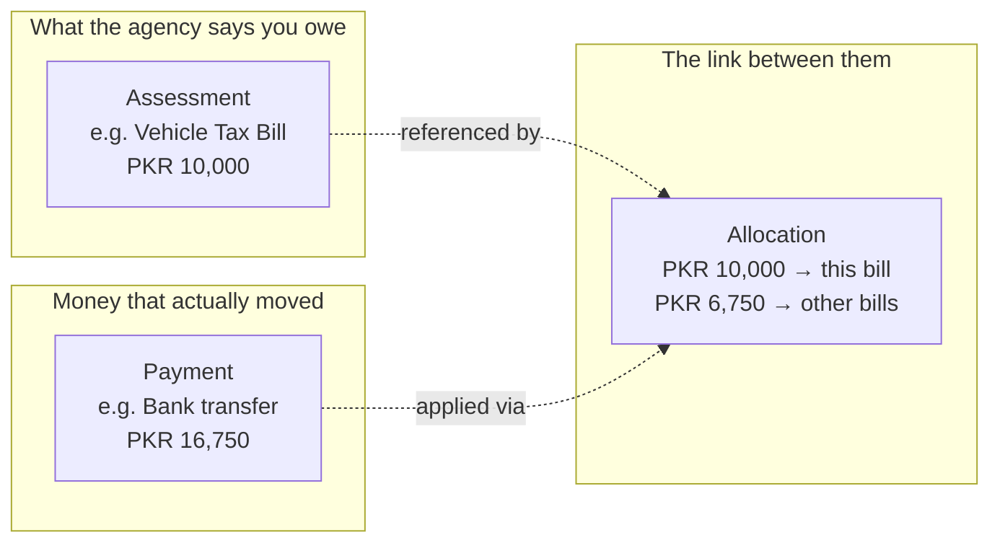

# 0. Introduction & Core Concepts

## What is NexusCollect?

NexusCollect is a **Person-to-Government (P2G) payment collection platform**. In plain terms: it is the system that sits behind a government's bill-collection experience — the kind of thing you'd interact with when paying vehicle tax, a traffic fine, an income tax bill, or a customs duty — and it does three things:

1. Lets a **citizen** find out what they owe, from any government agency, using almost any reference they might have to hand (a vehicle number, a CNIC, a case number, a bill/PSID printed on a paper challan, and more), and pay it through whatever channel is convenient (a bank app, a wallet, a bank branch counter, a cheque, or a card).
2. Correctly and provably **applies that money** to the right bill, for the right agency, down to the individual line item (principal vs. penalty vs. surcharge), even when a single payment covers several bills across several agencies at once.
3. Gives **government agencies and internal operations staff** a trustworthy, auditable, and reconcilable record of exactly what has been collected, what has been confirmed as good funds, and what has actually reached the treasury — as three separate, honest numbers, never blurred into one.

It is **not** a tax policy engine, a customs system, or a general ledger for the government's own spending — it is purpose-built for the narrow but critical job of *collecting money owed to government agencies and proving, beyond doubt, where every rupee went.*

## Who uses it

| Role | What they do in the system |
|---|---|
| **Citizen / payer** | Looks up their own bills and pays them. Never needs an account or a login. |
| **Teller** | Accepts cash, cheques, and other in-person instruments on a citizen's behalf at a physical counter. |
| **Reconciliation analyst** | Investigates and proposes resolutions for daily reconciliation mismatches ("breaks"). |
| **Reconciliation approver** | Reviews and approves (or rejects) a break resolution proposed by an analyst. *This is always a different person from the analyst — see [Maker-checker](#maker-checker-separation-of-duties) below.* |
| **Agency finance officer** | Monitors their agency's collected, settled, and swept position; runs reports. |
| **Operations / back-office staff** | Manage the day-to-day queues: unapplied money, uncertain payments, instrument lodgement, refund/settlement approvals. |
| **Auditor / government reviewer** | Verifies the integrity of the ledger and the audit trail; runs the control assertions. |

## The handful of ideas you need before anything else makes sense

Everything else in this manual assumes you understand the six ideas below. They are not incidental technical details — they are *why* several screens are built the way they are, and skipping them will make later sections confusing.

### 1. A bill can be found by almost any reference (not just its own ID)

Every government bill in the system has one canonical identifier: the **PSID** (Payment Slip ID) — a long numeric reference with a built-in check digit, similar in spirit to how a bank account number or an IBAN has a check digit that catches typos. But almost nobody carries their PSID around in their head. So the platform lets you look a bill up by *whatever you actually have*:

- A vehicle registration number (e.g. `LEA-17-1000`)
- A CNIC (national ID number)
- A case or challan number
- A property ID
- A QR code printed on a paper challan
- ...and several other reference types

Behind the scenes, all of these resolve back to the same PSID(s). This is what Screen 1 (Citizen Payment) does first, every time.

### 2. Assessment, Payment, and Allocation are three separate things

This is the single most important modelling idea in the whole platform, and it is deliberate:

- An **Assessment** is what an agency says you owe (a bill: "PKR 10,000 for vehicle tax, due 30 June 2026"). It exists whether or not anyone has paid it yet.
- A **Payment** is money that has actually moved (a citizen paid PKR 16,750 via their bank app on 30 July 2026). It exists independently of which bill(s) it was meant for.
- An **Allocation** is the record that *links* a payment to an assessment (and even to a specific line item within that assessment — e.g. PKR 920,000 of a payment went to "Income Tax," PKR 12,880 went to "Surcharge," and PKR 11,000 went to "Penalty," all from one single bank transfer).

Why keep these three separate instead of just marking a bill "paid"? Because real-world money movement is messier than "paid" or "not paid":

- One payment can settle **multiple bills across multiple agencies** at once.
- A payment can arrive **before** it's clear which bill it belongs to (see "unapplied" below).
- A payment can later need to be **reversed** (a cheque bounces) without ever pretending the original bill was never touched — the history has to stay intact.
- An agency needs to know the **allocated** amount for its own bookkeeping, completely independently of whether that money has physically reached its own bank account yet (see "confirmed vs. settled vs. swept" below).

A payment is never asked "which bill are you for" and forced to answer with only one bill. An allocation can point at several assessments, and an assessment can be paid off by several allocations from several different payments over time. This is also why a single Citizen Payment lookup can show bills from **two completely different government agencies** in one list, and why paying "all" of them at once still correctly credits each agency separately.

### 3. Confirmed, settled, and swept are three different, honestly-reported numbers

When an agency looks at its dashboard, it does **not** see one number called "collected." It sees three:

| Term | Meaning |
|---|---|
| **Confirmed** | Money has been definitively applied to this agency's bills (an allocation exists and the payment behind it is good). This is the agency's own bookkeeping position — "what we are owed has been reduced by this much." |
| **Settled** | The bill itself has reached a final state (fully paid, in this platform's terms) because enough confirmed allocations have been applied against it. |
| **Swept** | The actual cash has been physically transferred out of the platform's collection account and into the government's treasury account. |

These numbers can — and routinely do — differ. Money can be confirmed and the bill settled today, while the physical cash sweep to treasury only happens on the next scheduled sweep cycle. A cheque might be *provisionally* counted before it clears, and — critically — **provisional (uncleared) funds can never be swept**, so "swept" is always a conservative, bank-proven number.

This separation is why a government reviewer can trust the dashboard: it never tells them money has reached the treasury before it actually has.

### 4. `UNCERTAIN` is a real, first-class state — not a failure

If a payment arrives through a channel where the platform genuinely cannot yet tell whether it succeeded (a rail confirmation is delayed, a statement hasn't arrived yet), the platform does **not** guess. It also does **not** tell the citizen their payment failed — because it might not have. Instead, the payment sits in a dedicated `UNCERTAIN` state until an operations user resolves it, using one of several real evidence sources (a rail status enquiry, a bank statement line, a human investigation). Only then does it become `CONFIRMED` (money definitely applied) or genuinely `FAILED`.

This matters because the single most damaging mistake a collection platform can make is to tell a citizen "your payment failed" when their bank account was in fact debited. NexusCollect is built so that can't happen by design.

### 5. Money that has left a payer's account is *always* accepted — never rejected

If a bank confirms money has left a payer's account, the platform never bounces it back, even if it arrives late, for the wrong amount, or with an unclear reference. Rejecting money that a citizen has already paid is treated as the single most expensive kind of mistake this system can make — worse than temporarily holding an amount as *unapplied* until someone works out where it belongs (see the **Unapplied Queue** in the back-office screens).

### 6. Maker-checker (separation of duties)

Certain actions — most importantly, resolving a reconciliation break, or approving a refund — always require **two different people**. The person who investigates and proposes a resolution (the "maker") can never also be the person who approves it (the "checker"). This is enforced by the system itself, not just by policy, and you'll see it called out specifically wherever it applies.

## Four portals, not one screen

The platform is not one application. It is **four separate portals**, each served
from its own address, each built for one kind of person doing one kind of work:

| Portal | Address in the demonstration | Who it is for |
|---|---|---|
| **Citizen** | `pay.localhost:5174` | Members of the public. Public, no sign-in, phone-shaped. |
| **Agency** | `agency.localhost:5175` | An agency's own finance and revenue staff. Scoped to that agency and nothing else. |
| **Operator** | `ops.localhost:5176` | The platform's back office. Cross-agency, dense, built for queues. |
| **Field** | `field.localhost:5177` | Counters, branches and shops. Oversized targets, high contrast, one task at a time. |

This matters more than it might sound. A citizen's payment screen and an
operator's reconciliation console have nothing to do with each other — different
people, different buildings, different trust levels — and putting them in one
window would be a claim about the product that isn't true. Separating them is also
a real security boundary rather than a cosmetic one: the citizen portal is built
and served independently, so its bundle cannot contain operator code even by
accident.

The split follows a boundary the platform already had. Its API has always been
five separately-scoped surfaces — `/v1` for institutions, `/switch` for the
payment switch, `/public` for anyone, `/internal` for staff, `/admin` for
configuration. The front end was the only layer ignoring a division the back end
already enforced.

Each portal is documented on its own:

- [Citizen portal](02-citizen-portal.md)
- [Agency portal](03-agency-portal.md)
- [Operator portal](04-operator-portal.md)
- [Field portal](05-field-portal.md)

## How the demonstration is driven

Above every portal sits a dark **demonstration harness** bar: the persona
switcher, the portal switcher, the demo clock, a reset button, and a button that
deliberately corrupts the ledger. None of it belongs to the product. It is
labelled as what it is, and it is documented in full in
[The demonstration harness](01-demonstration-harness.md) — read that before the
portal chapters, because everything else assumes you know how to become a
different person and how to move the clock.

## One more idea: what is owed is not what was assessed

An **assessed** amount is what the bill was raised for. A **payable** amount is
what must actually be collected today, which may be lower — an early-payment
discount reduces it, and the discount is live only while it lasts. The two are
kept as separate figures on purpose, and a bill's line items always sum to the
*assessed* amount, never the discounted one, because each line has to keep
crediting its own revenue head for the agency's reporting to hold.

The practical consequence is visible on the citizen portal: a PKR 5,000 traffic
fine with a live PKR 1,250 discount is quoted, charged, and receipted at PKR
3,750, and the bill is then fully settled. What the payer was quoted and what the
ledger records are the same number.

## What's next

Read [The demonstration harness](01-demonstration-harness.md) next — it explains
the controls that sit above every portal. Then work through the four portal
chapters in order, or jump straight to any of them from the
[table of contents](README.md).
