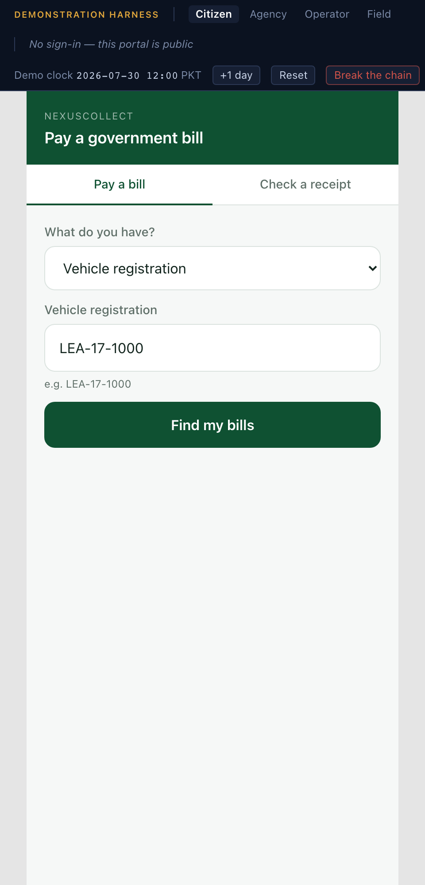
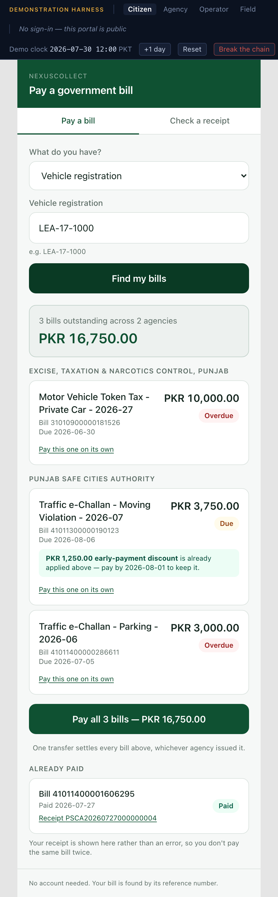
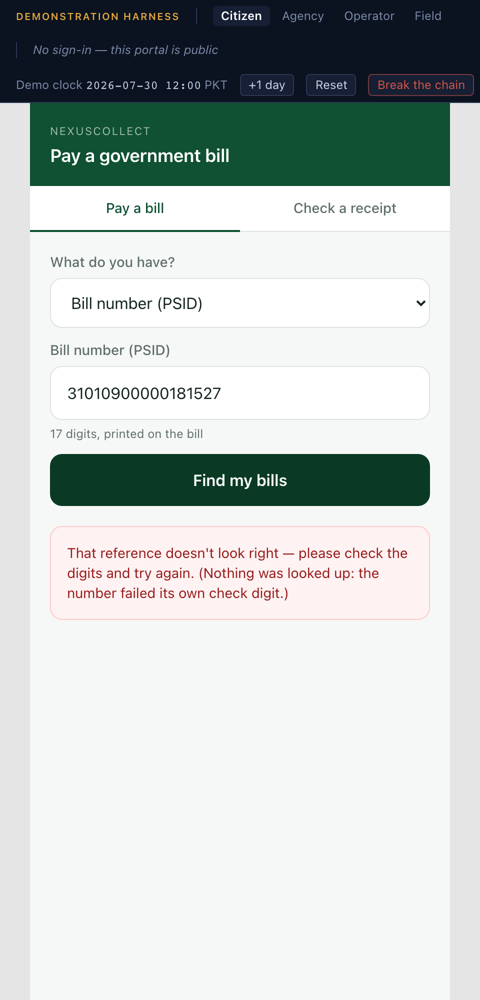
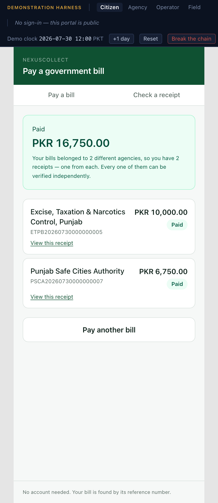
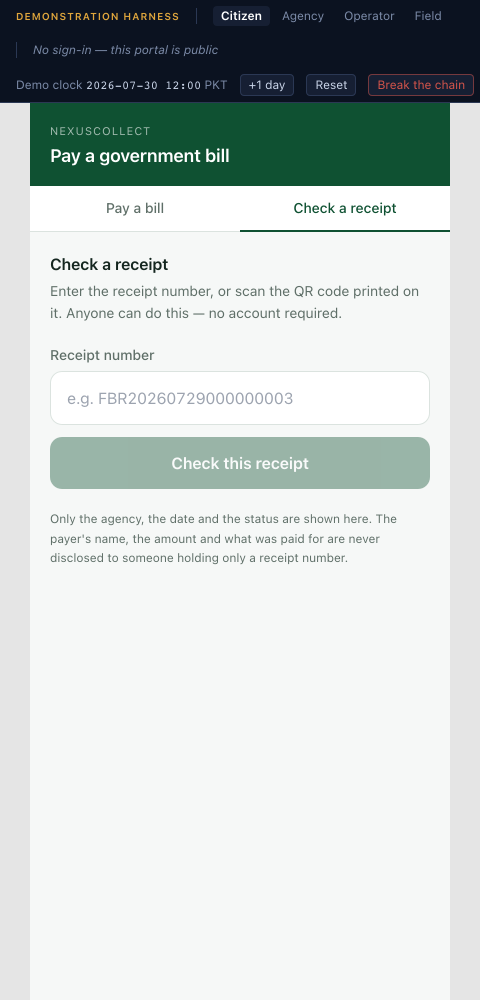

# 2. The citizen portal

**`pay.localhost:5174`** — public, no sign-in, built for a phone.

Three screens: find and pay a bill, the receipt, and check a receipt. That is the
whole portal, deliberately.

## Why it is deliberately narrow

The audience for this demonstration is a ministry or a collecting agency, not a
consumer. What they need to see is that money genuinely moves — because every
figure in the agency and operator portals is only meaningful if the payments behind
it are real rather than narrated. This portal exists to make that true.

Narrow is not the same as unfinished, and one part of it is held to a much higher
standard than the rest: **the receipt**. It is the only artefact that leaves the
platform, gets printed, and ends up in a file somebody else audits years later. It
is built accordingly.

On a desktop the portal renders inside a phone-width frame, so a reviewer sees it
for what it is instead of a stretched-out mobile page.

---

## Find and pay a bill

The payer chooses what they are holding — not a technical reference type — and
types it in:

| What the payer has | Example |
|---|---|
| Vehicle registration | `LEA-17-1000` |
| Bill number (PSID) | 17 digits, printed on the bill |
| CNIC | 13 digits |
| NTN | National Tax Number |
| Case number | `CP-1123/2026` |
| Application number | `NAD-2026-8891200` |
| Scanned QR code | whatever the scanner read |

There is no account, no password and no registration. This is the point: it has to
work for somebody who has never used the platform before and never will again.

### One reference, two agencies

Looking up the vehicle registration `LEA-17-1000` returns **three outstanding
bills belonging to two different agencies**, in one list, with one total of
**PKR 16,750.00**:

| Agency | Bill | PSID | Amount | Status |
|---|---|---|---|---|
| Excise, Taxation & Narcotics Control, Punjab | Motor Vehicle Token Tax 2026-27 | 31010900000181526 | 10,000.00 | Overdue |
| Punjab Safe Cities Authority | Traffic e-Challan — moving violation | 41011300000190123 | 3,750.00 | Due |
| Punjab Safe Cities Authority | Traffic e-Challan — parking | 41011400000286611 | 3,000.00 | Overdue |

This single list is the entire argument for a shared collection platform, which is
why the bills are grouped by agency rather than flattened into an anonymous total.
Without the platform the payer visits two organisations; with it they tap once.

The moving-violation challan carries a **live PKR 1,250.00 early-payment
discount**, called out under the bill with the date it expires. The PKR 3,750.00
shown already has the discount applied — the payer is quoted what they will
actually be charged, and that is also the figure the ledger will record.

### Already paid, shown as a receipt

Further down, a fourth bill appears under **Already paid**, with its receipt number
and a link to verify it.

This is not a courtesy. Returning a settled bill with its receipt attached, rather
than as an error or an empty result, is what prevents the single most common
duplicate payment: somebody paying again because they could not find proof they had
already paid.

### A typo is caught before anything is looked up

A PSID carries a check digit. Enter one with a digit changed and the rejection is
immediate and specific:

> That reference doesn't look right — please check the digits and try again.
> (Nothing was looked up: the number failed its own check digit.)

The parenthetical is true and worth saying. The reference is validated
arithmetically before any database query happens at all, which is why the response
is instant and why a mistyped bill number cannot be used to probe for real ones.

Vehicle registrations have no check digit, so this protection only applies to
reference schemes that carry one.

### Paying

**Pay all 3 bills — PKR 16,750.00** does what it says, with one important
subtlety.

The payer taps once, but the platform creates **one payment per agency** — so this
produces two payments and two receipts:

| Receipt | Agency | Amount |
|---|---|---|
| ETPB20260730000000005 | Excise, Taxation & Narcotics Control, Punjab | 10,000.00 |
| PSCA20260730000000007 | Punjab Safe Cities Authority | 6,750.00 |

A payment belongs to exactly one agency, and it has to: the sweep moves a payment
into *one* treasury account and the scroll to treasury is emitted per agency. A
single payment spanning two agencies could never be settled correctly, however
tidy it might look on screen. So the split is real, and the portal shows it rather
than hiding it.

This is also the honest answer to the question an agency finance officer actually
asks about a shared platform: *how do I know my money is mine?* Because it was
never mixed with anyone else's in the first place.

### Card, wallet and a printable challan

Each bill also offers **Card**, **Wallet** and **Challan** individually.

The card path is worth watching. There is no card-number field on this screen, and
there is none anywhere in the platform. A hosted field returns a token; the token,
the first six digits and the last four are the whole of what is ever stored. The
confirmation says exactly that:

> Card payment confirmed. Stored: the gateway token, BIN 435671 and last four 4242
> — the card number itself never reached the platform.

That is what keeps the platform outside PCI scope, and it is a claim best made by
showing the absence of the field rather than by asserting it in a slide.

---

## The receipt

The receipt is rendered **from the signed payload**, not from a convenient query.
What the payer reads is byte-for-byte what was cryptographically signed — so a
receipt that displays can never disagree with a receipt that verifies.

It carries the full field set: the issuing agency, the receipt number, the payment
reference, the payer, the channel and the rail, the value date and the obligation
discharge date, the head-wise breakdown, the total in figures **and in words**, and
a scannable verification QR code.

### Head-wise, and it sums

The PSCA receipt above breaks PKR 6,750.00 into the revenue heads it actually
credited:

| Revenue head | Bill | Amount |
|---|---|---|
| C05110 Traffic Fines — Moving Violations | 41011300000190123 | 3,750.00 |
| C05115 Traffic Fines — Parking & Static | 41011400000286611 | 2,000.00 |
| C05191 Escalation Penalty — Traffic | 41011400000286611 | 1,000.00 |

Three heads, two bills, one payment — and the lines sum to the total. A receipt
whose parts do not add up to its own total is the first thing an auditor rejects,
so it is asserted by a test rather than hoped for.

Note that the discounted bill contributes PKR 3,750.00, not its PKR 5,000.00
assessed principal. The payer was quoted the discounted figure and the ledger
recognises the discounted figure.

### In English and in Urdu

A language toggle switches the whole receipt between English and Urdu. The Urdu
rendering is right-to-left, set in Nastaliq, with Urdu-Indic numerals for dates and
the amount spelled out in Urdu words:

> **الفاظ میں:** چھ ہزار سات سو پچاس روپے صرف

The amount in words is a requirement rather than a flourish — it is what makes a
printed receipt hard to alter after the fact, and it is the line somebody reads when
the figure looks wrong.

**One thing is deliberately not translated:** the revenue head names. Those are the
agency's own published chart-of-accounts descriptions, and inventing Urdu
equivalents for them would be fabricating reference data. They appear verbatim in
both languages, and that is the correct behaviour rather than a gap.

### Verifying it offline, for real

Two buttons sit under the receipt: **Verify as issued** and **Alter one digit**.

Both run the Ed25519 signature check **inside the browser**, using WebCrypto and
the public key embedded in the receipt bundle. No request is made to the platform.
The result says where it ran:

> ✓ Signature valid. The receipt is genuine and unaltered.
> *Checked in this browser, with no network or database access.*

**Alter one digit** changes a single digit of the payload before checking, and the
signature fails. That is the whole claim, demonstrated rather than asserted:
somebody with the receipt and the public key, and no access to the platform at all,
can tell a genuine receipt from an altered one.

If a browser is too old to do Ed25519 in WebCrypto, the check falls back to the
platform's endpoint — and says so, rather than quietly claiming a local check that
never happened.

### Provisional money says so on its face

A receipt for a payment made with an instrument that has not yet cleared carries an
unmissable banner rather than a small badge:

> **PROVISIONAL — subject to realisation of the instrument**
> This payment was made by an instrument that has not yet cleared. The obligation is
> not discharged until it does.

A receipt that implies an uncleared cheque has discharged an obligation is worse
than no receipt at all, which is why the payment's finality is carried through to
the receipt rather than kept in the operator's view.

### When the payment is `UNCERTAIN`

If the platform cannot yet tell whether the payment succeeded, the payer sees a
calm holding state, never a failure:

> **We're still confirming your payment**
> This is not a failure and you have not been charged twice. Your bank has taken the
> money and we are waiting for confirmation. Your receipt will appear here once it
> arrives — usually within a few minutes.

Telling somebody their payment failed when their account was debited is the most
expensive mistake a collection platform can make. This screen is built so it cannot
happen.

---

## Check a receipt

Public, unauthenticated, and reachable directly by scanning the QR code on a
receipt. Enter a receipt number and the platform reports four things: the receipt
number, the issuing agency, the business date, and — the headline — the **status**.

| Status | What it means |
|---|---|
| **Valid** | Genuine, and not since voided or refunded. |
| **Voided** | Issued, but since voided — most commonly because the instrument behind it was returned unpaid. The obligation it covered is outstanding again. |
| **Refunded** | Genuine, but the payment behind it has since been refunded. |

"Since" is the part that matters. A receipt is never deleted, but it can be voided:
a bounced cheque takes its receipts down with it. Somebody holding a printed
receipt from three weeks ago needs to learn that here, which is why the status is
the headline and not a footnote.

Notice what is **not** shown: no payer name, no amount, and no description of what
was paid for. A landlord, an employer or a court clerk can confirm a receipt is
genuine without being handed anything else. Deliberate minimalism is the privacy
control.

A receipt number that was never issued returns a plain, useful answer:

> **No such receipt.** Nothing was ever issued under that number. Check the digits —
> and treat a receipt that cannot be found here as one that should not be relied on.

---

*Next: [The agency portal](03-agency-portal.md). Or return to the
[manual index](README.md).*
