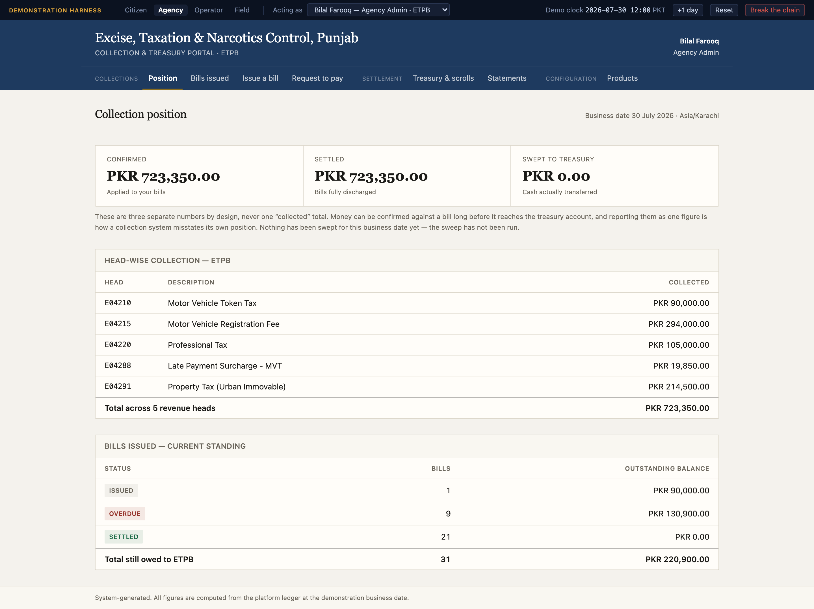
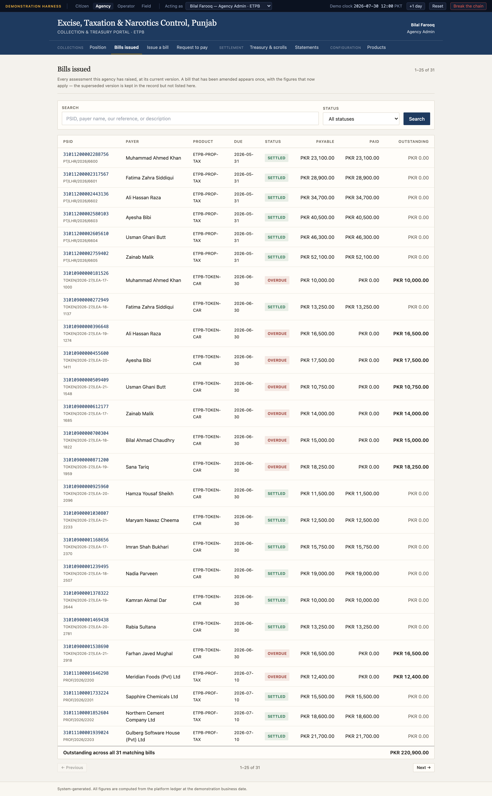
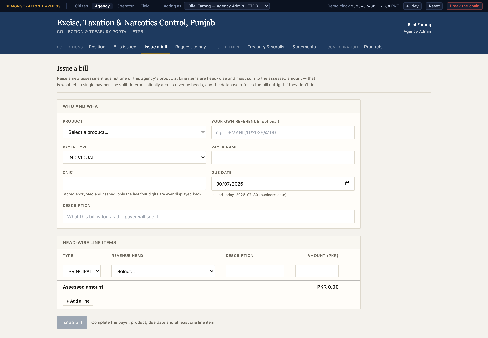
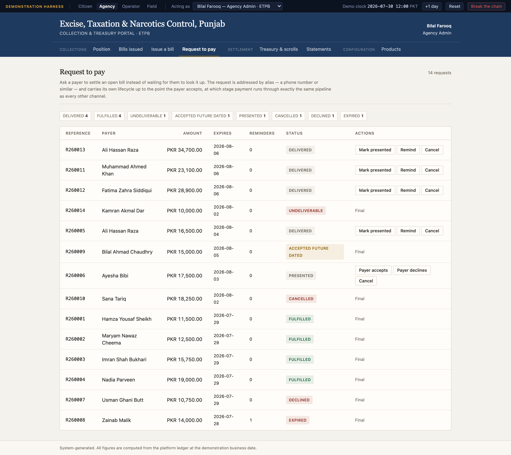
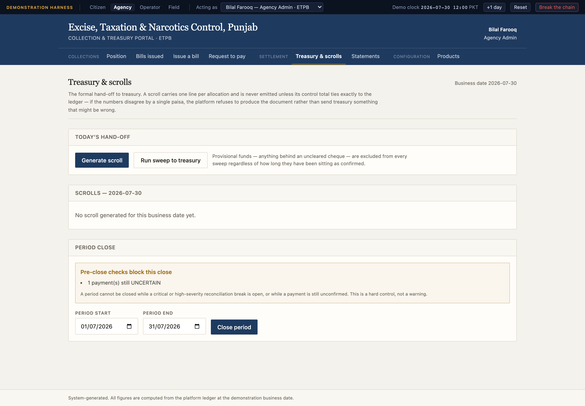
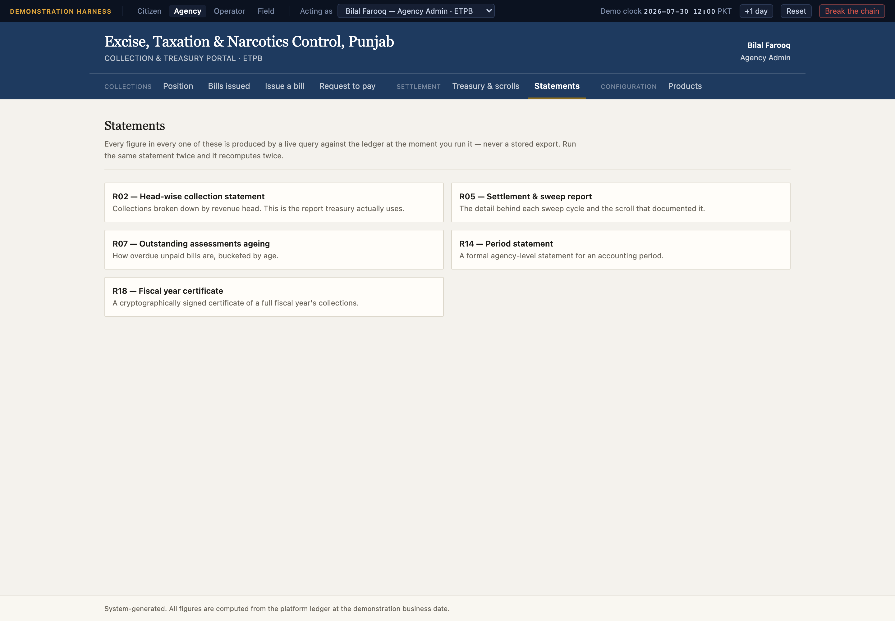
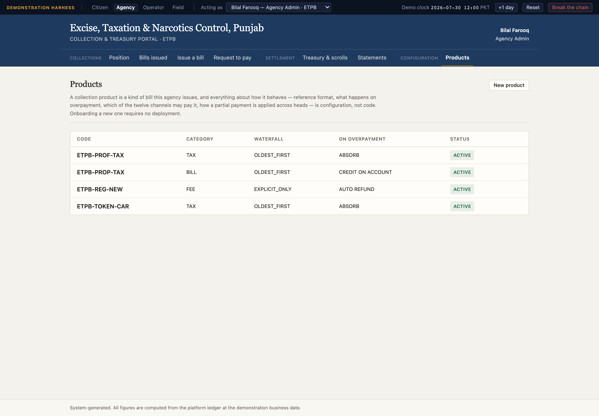

# 3. The agency portal

**`agency.localhost:5175`** — one agency, its own bills, its own money.

Sign in as **Bilal Farooq**, an agency administrator at the Excise, Taxation &
Narcotics Control department, Punjab (ETPB). Everything on every screen is scoped
to ETPB, and there is no control anywhere that widens it.

The portal is set in a serif face on warm paper, and looks institutional rather
than app-like, because the people using it are producing figures that go into a
government's own accounts.

Seven screens in three groups: **Collections** (Position, Bills issued, Issue a
bill, Request to pay), **Settlement** (Treasury & scrolls, Statements), and
**Configuration** (Products).

---

## Collection position

The screen the rest of the portal exists to support, and the one this
demonstration is judged on.

### Three numbers, never one

| | | |
|---|---|---|
| **CONFIRMED** PKR 723,350.00 | **SETTLED** PKR 723,350.00 | **SWEPT TO TREASURY** PKR 0.00 |
| Applied to your bills | Bills fully discharged | Cash actually transferred |

There is no figure on this screen called "collected", and that is the single most
important design decision in the portal. The three numbers mean genuinely different
things:

- **Confirmed** — money definitively applied to this agency's bills. The agency's
  own bookkeeping position: what it is owed has been reduced by this much.
- **Settled** — bills that have reached a fully-discharged state as a result.
- **Swept to treasury** — cash physically moved out of the collection account into
  the government's treasury account.

They routinely differ, and the screen says why rather than leaving the reader to
guess:

> These are three separate numbers by design, never one "collected" total. Money can
> be confirmed against a bill long before it reaches the treasury account, and
> reporting them as one figure is how a collection system misstates its own position.
> Nothing has been swept for this business date yet — the sweep has not been run.

Swept is deliberately the most conservative of the three. Provisional money — a
cheque that has not cleared — can never be swept, so this figure is always
bank-proven. A finance officer can trust it precisely because it lags.

### Head-wise, because that is how government reports

| Head | Description | Collected |
|---|---|---|
| E04210 | Motor Vehicle Token Tax | 90,000.00 |
| E04215 | Motor Vehicle Registration Fee | 294,000.00 |
| E04220 | Professional Tax | 105,000.00 |
| E04288 | Late Payment Surcharge — MVT | 19,850.00 |
| E04291 | Property Tax (Urban Immovable) | 214,500.00 |
| | **Total across 5 revenue heads** | **723,350.00** |

Government financial reporting is organised by revenue head, not by transaction, so
this is the table an agency actually needs. Note E04288: surcharge is collected
against its own head, not folded into the tax it accrued on — which is what makes it
separately reportable and separately auditable.

### What is still owed

| Status | Bills | Outstanding balance |
|---|---|---|
| ISSUED | 1 | 90,000.00 |
| OVERDUE | 9 | 130,900.00 |
| SETTLED | 21 | 0.00 |
| | **31 bills** | **220,900.00** |

Settled bills stay in the table with a zero balance rather than disappearing. The
count of bills raised is itself a number the agency reports on.

The footer states the provenance plainly: *System-generated. All figures are
computed from the platform ledger at the demonstration business date.* Nothing on
this screen is a cached total that could drift from the ledger it claims to
summarise.

---

## Bills issued

Every assessment ETPB has raised, filterable by status, with its PSID, product,
payer, dates, assessed and payable amounts, and current balance.

One detail worth knowing: an **amended** bill appears once, not twice. When a bill
is amended the platform never edits it — it writes a new version and marks the old
one `AMENDED`, keeping the same PSID. This list shows the live version, because
showing both would double-count what the agency is owed.

Clicking through to a single bill shows its line items with their individual
revenue heads and balances, its full payment history, and the receipts issued
against it.

---

## Issue a bill

An agency raising a new assessment: choose the product, identify the payer, set the
amount and the dates, and issue.

### The PSID is minted, not typed

The interesting part is what happens when the form is submitted without a PSID: the
platform **mints one**, using the product's own reference scheme.

The layout is documented in the platform's `reference_scheme` configuration —
a prefix, a four-digit product code, a sequence, and a check digit computed with
the scheme's own algorithm. So a newly minted PSID is immediately resolvable on the
citizen portal, and a typo in it is caught by the same arithmetic that catches a
typo in a seeded one.

Two narrowings are worth disclosing rather than glossing: the sequence is a pure
counter rather than partly random, so the demonstration is deterministic; and the
product code is read from the product's existing bills rather than from a separate
registry. Both are stated in the code that does it.

Issuing a bill is a real state transition — it writes an audit entry and an outbox
event in the same transaction as the bill itself, so the bill cannot exist without
the record that it was created.

---

## Request to pay

The platform asking to be paid, rather than waiting to be looked up. An agency
raises a Request to Pay against an open bill and it travels through its own
lifecycle, with every transition recorded:

`CREATED → SENT → DELIVERED → PRESENTED → ACCEPTED → FULFILLED`

with `DECLINED`, `EXPIRED`, `CANCELLED` and `UNDELIVERABLE` as the other endings, and
partial and future-dated acceptance as their own accepted states.

**Acceptance is not payment**, and the distinction matters. Accepting a request is
the payer agreeing to pay it; the money still moves through their own bank, on the
ordinary channel pipeline, exactly as it would if they had looked the bill up
themselves. The request is then *fulfilled* by linking that payment to it — which is
what lets an agency see which of its requests actually produced money, and which are
sitting accepted but unpaid.

**Fulfilment happens on its own.** When a payment settles every bill a request
covers, the platform closes the request and records which payment did it. Nobody
presses anything, because a request left open until an operator remembers to tick it
off would make this screen answer the wrong question — accepted, rather than paid. A
request covering three bills stays open until all three are settled, whichever
payments settled them.

Nothing about the money path is special-cased for this route, which is the point: a
Request to Pay changes who starts the conversation, not how the collection works.

This screen is also where **mandates** become comprehensible: a standing mandate is
an automated Request to Pay whose acceptance was granted once, in advance, when the
mandate was set up. It is the same machinery, not a parallel implementation.

---

## Treasury & scrolls

Where the agency's money leaves the platform.

- **Sweep** — moves confirmed, final money into the agency's treasury account.
  Provisional funds are refused, by rule, every time.
- **The scroll** — the formal hand-off document, one line per allocation, with a
  control total and a detail hash. It is never emitted unless its total ties exactly
  to the ledger, which is the point of it: treasury is being asked to acknowledge
  receipt of exactly what the platform says it sent.
- **Treasury acknowledgement** — treasury accepts or rejects lines. A rejected line
  does not vanish; it becomes a reconciliation break of its own, classified as a
  *filing* problem rather than missing cash, because the money is already banked.

The specification's own remark is worth repeating here: one good scroll is worth ten
screens. It is the artefact a government finance department will actually ask to see.

---

## Statements

The agency's own reports, generated from live queries rather than stored summaries:
collections by head, by product, by channel, by date; outstanding ageing; settlement
and sweep history.

Where a report cannot be produced honestly from data the platform actually holds, it
says so instead of estimating. That discipline is deliberate and applies throughout —
a metric with no real source is disclosed as a gap, never approximated.

---

## Products

The configuration behind everything else: for each of the agency's collection
products, its reference scheme, its amount rules, its surcharge and discount rules,
its allowed channels, which instruments it accepts, its allocation waterfall, its
partial-payment and overpayment policies, and the revenue heads its line items credit.

This screen explains most of the behaviour a reviewer will have questions about.
Why did that payment settle penalty before principal? Because this product's
waterfall says `PENALTY_FIRST`. Why did that bill carry a discount and this one not?
Because the discount rule is configured per product and is live for a defined window
after issue. Why was a cheque accepted here and refused there? Because instrument
acceptance is a per-product setting.

Nothing in that list is hardcoded in the platform. It is data, which is why a new
collection product can go live without a code change.

---

*Next: [The operator portal](04-operator-portal.md). Or return to the
[manual index](README.md).*
