# 4. The operator portal

**`ops.localhost:5176`** — the platform's own back office. Cross-agency, dense,
and organised around queues rather than dashboards.

Nineteen screens, grouped down the left rail by what the operator is actually
trying to do:

| Group | Screens |
|---|---|
| — | Today |
| **Investigate** | Payment 360°, Payer 360°, Assessment 360°, UNCERTAIN queue, Unapplied receipts |
| **Reconcile** | Recon console, Break register |
| **Exceptions** | Refunds, Disputes, Approvals inbox, Instrument clearing |
| **Money movement** | Sweep operations, Bulk payments |
| **Assurance** | Control assertions, Audit trail, Platform overview |
| **Reports** | Operational reports |
| **Administration** | Roles |

The grouping is not decoration. An operator's day has a shape — find out what
happened, reconcile it, deal with what broke, move the money, prove it was right —
and a flat list of nineteen links hides that shape entirely.

---

## Today

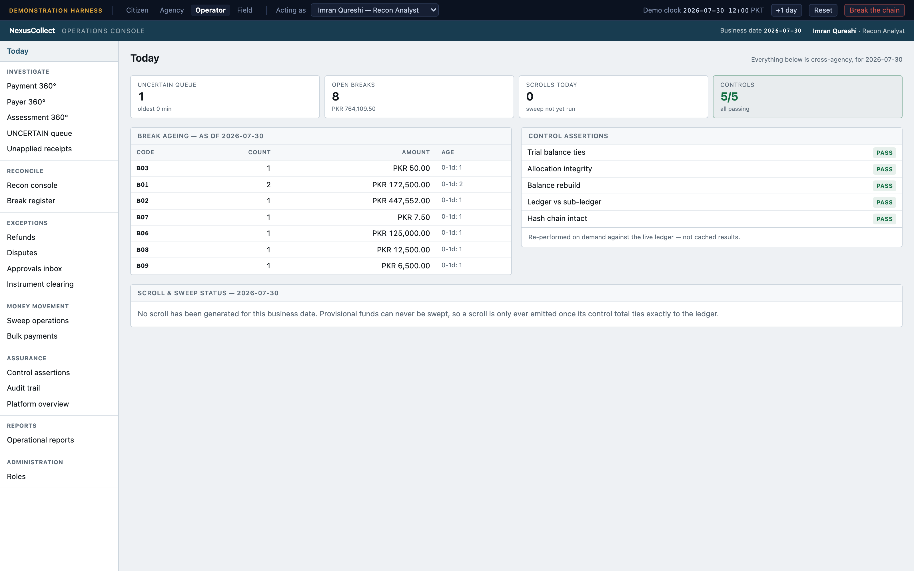

Four figures and three panels, all cross-agency, all for the current business date:

- **UNCERTAIN queue** — depth, and the age of the oldest item. Age matters more
  than count: one payment stuck for two hours is a worse problem than twenty stuck
  for two minutes.
- **Open breaks** — count and unexplained value.
- **Scrolls today** — how much has been handed to treasury.
- **Controls** — how many of the five control assertions are passing.

Underneath: break ageing, the five control assertions with live pass/fail, and
scroll and sweep status. The panels explain themselves when empty rather than
showing a blank box — *"No scroll has been generated for this business date.
Provisional funds can never be swept, so a scroll is only ever emitted once its
control total ties exactly to the ledger."*

---

## Investigate

### Payment 360°

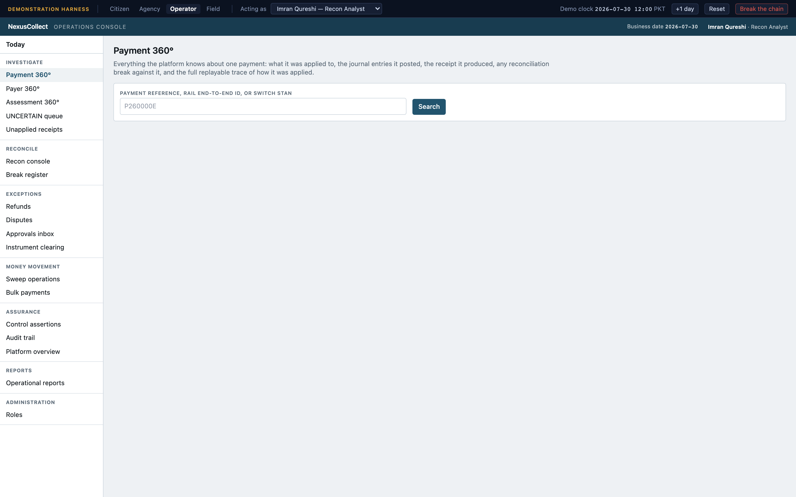

Everything known about one payment: its reference, channel and rail, its gross and
unapplied amounts, its value date and obligation discharge date, its finality, its
status, every allocation it produced with the head each credited, the receipt issued,
the journal entries posted, and its `application_trace` — the recorded reasoning of
how the apply pipeline decided what it decided.

That trace is the reason this screen is called 360° rather than "payment detail". An
operator can answer *why* a payment was applied the way it was, not just *that* it
was, and the answer comes from what the pipeline actually recorded at the time rather
than a reconstruction.

Reversal and recall actions live here, because both are always raised against a
specific payment somebody is already looking at.

### Payer 360°

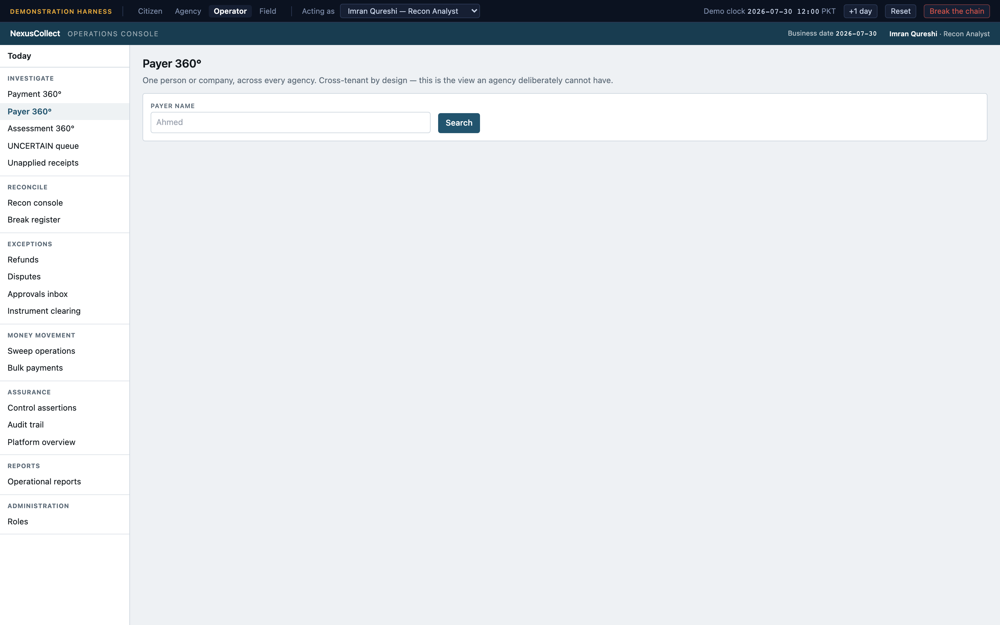

One payer across every agency: their accounts, their bills, their payment history,
their mandates, and any disputes. This is the screen a support agent needs when
somebody calls, and the cross-agency view is exactly what the payer themselves
experiences — so support can see what the caller sees.

### Assessment 360°

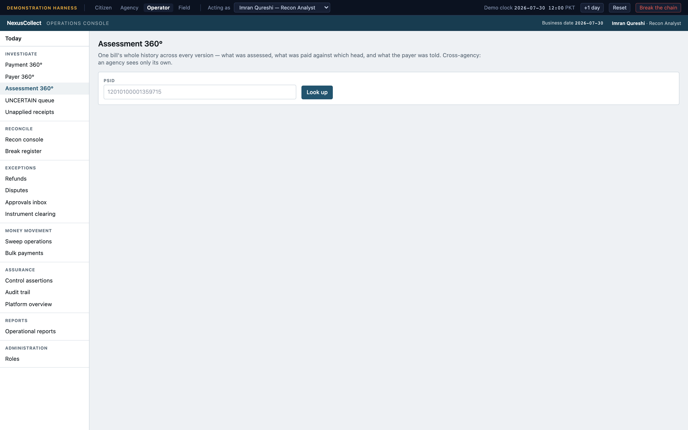

One bill in full: its versions, its line items and the revenue head each credits,
every allocation applied to it, its receipts, its service-gate state, and its
derived amounts recomputed live.

Refundable-deposit bills expose their three distinct exits here — refund, forfeit,
or convert to revenue — because a deposit is not revenue and the decision about
which it becomes is a real one somebody has to make.

### UNCERTAIN queue

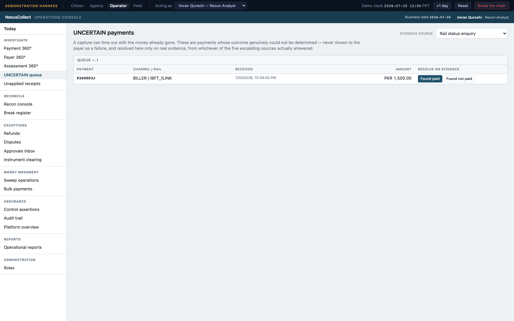

Payments where the platform cannot yet tell whether the money moved. This is the
most important queue in the platform, and the specification says so.

The rule is that the platform never guesses. A capture attempt that does not return
a definite success or failure lands here, and it is resolved by evidence — a rail
status enquiry, a statement line, a human investigation — not by assumption. Only
then does it become `CONFIRMED` or genuinely `FAILED`.

Meanwhile the payer is never told their payment failed. That is the whole reason the
state exists: the most expensive mistake this kind of platform can make is to tell
somebody their payment failed when their account was debited.

### Unapplied receipts

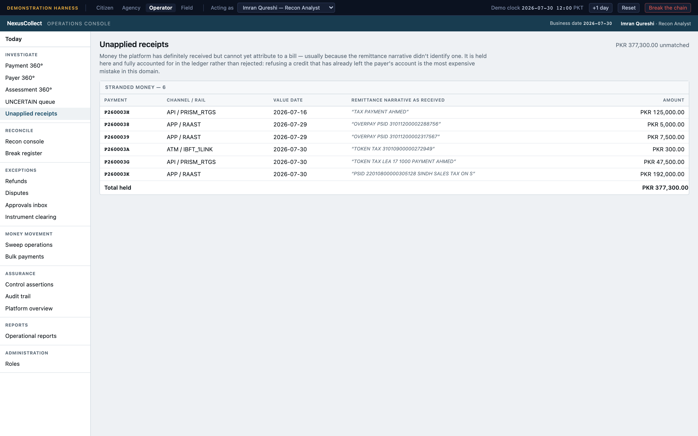

Money the platform has definitely received but cannot yet attribute to a bill.

It is held, fully accounted for, and visible — never returned. Rejecting a credit
that has already left a payer's account is treated as a worse outcome than holding
it while somebody works out where it belongs. Ageing is shown, because unapplied
money that sits for two weeks is a different problem from unapplied money that
arrived an hour ago.

---

## Reconcile

### Recon console

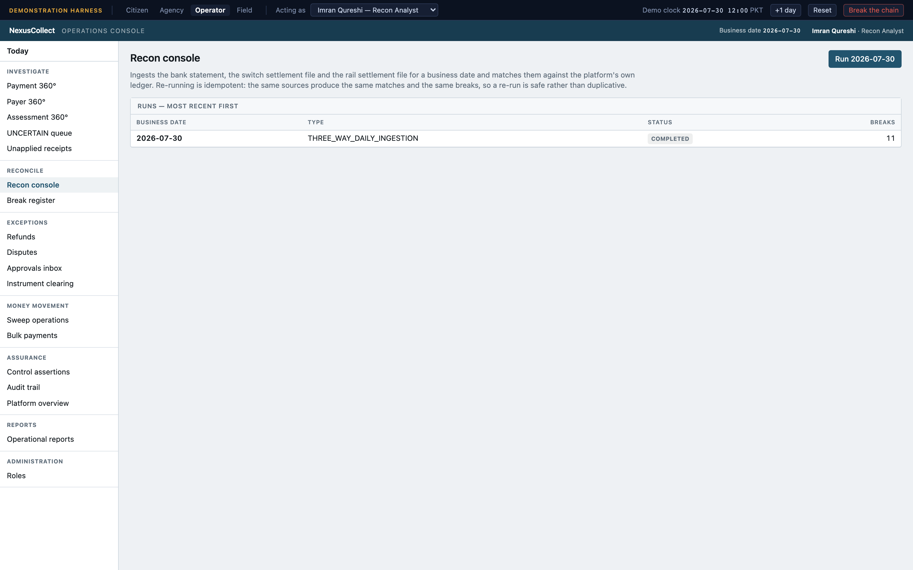

Runs reconciliation for a business date and shows the history of runs: what was
ingested, how many records matched, how many breaks were raised, and how many
resolved themselves.

Three-way, against three independent sources: the bank statement, the switch
settlement file, and the rail settlement file. A run is idempotent — re-running it
produces the same result rather than duplicating breaks — and the same file cannot be
ingested twice, enforced by its content hash. A file whose control total does not
match its contents fails the run outright rather than being partially absorbed.

### Break register

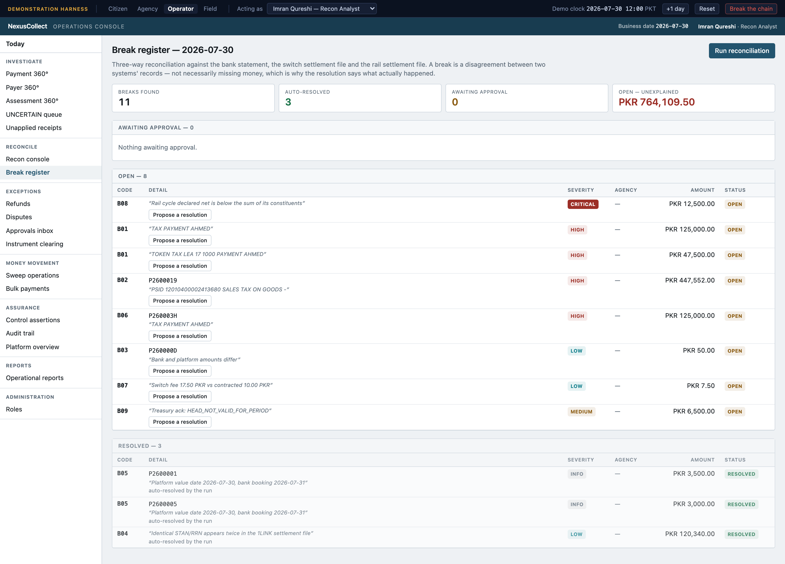

Reconciliation for 30 July 2026 finds **11 breaks**: 3 that resolve themselves, 8
that need a person, and **PKR 764,109.50** unexplained.

| Code | What it is | Amount | Severity |
|---|---|---|---|
| B08 | Rail cycle declared net is below the sum of its constituents | 12,500.00 | Critical |
| B01 | Unmatched bank credit — *"TAX PAYMENT AHMED"* | 125,000.00 | High |
| B01 | Unmatched bank credit — *"TOKEN TAX LEA 17 1000 PAYMENT AHMED"* | 47,500.00 | High |
| B02 | Unmatched platform payment | 447,552.00 | High |
| B06 | Unapplied receipt aged beyond tolerance | 125,000.00 | High |
| B03 | Bank and platform amounts differ | 50.00 | Low |
| B07 | Switch fee 17.50 vs contracted 10.00 | 7.50 | Low |
| B09 | Treasury acknowledgement: `HEAD_NOT_VALID_FOR_PERIOD` | 6,500.00 | Medium |

And, in the resolved section, the three that needed nobody:

| Code | What it is | Amount |
|---|---|---|
| B05 | Platform value date 2026-07-30, bank booking 2026-07-31 | 3,500.00 |
| B05 | Same, another payment | 3,000.00 |
| B04 | Identical STAN/RRN appears twice in the 1LINK settlement file | 120,340.00 |

Several things about this register are deliberate:

**A break is a disagreement, not missing money.** The screen says so at the top,
because the instinct on seeing "11 breaks, PKR 764,109.50" is to assume three
quarters of a million rupees has gone missing. Most of these are filing problems. B09
in particular is money already sitting in the treasury account, posted to a head
treasury does not accept for that period — a classification issue, and it is styled
as one rather than as an alarm.

**Auto-resolved breaks read as resolved.** The two B05 timing differences and the
duplicated B04 settlement row are in their own section, marked *auto-resolved by the
run*. Timing differences across a date boundary and a duplicated file row are
mechanically identifiable, so a human is not asked to look at them.

**The narrative is quoted verbatim.** *"TOKEN TAX LEA 17 1000 PAYMENT AHMED"* is what
the bank actually sent. It is shown exactly as received because the operator's job is
to read it, and one of the two B01 credits is resolvable from that text — it contains a
vehicle registration the platform can resolve — while the other genuinely is not.

### Resolving a break, under maker-checker

Every open break offers **Propose a resolution**, with five resolution types: match
it manually, accept it as a timing difference, reclassify it, write it off, or
escalate it to the agency.

Then the control that matters: **the person who proposes cannot be the person who
approves**. This is enforced at two levels — the same user id is refused outright, and
proposal and approval require *different roles*, `OPS_RECON_ANALYST` to propose and
`OPS_RECON_APPROVER` to approve.

The role separation is the part that makes it meaningful. Two accounts belonging to
the same person defeats a same-id check; requiring two different roles does not. Break
resolution is the one place in the platform where maker-checker is enforced this
strictly, because it is the one place where a person can make a discrepancy disappear.

To watch it work, use the harness: propose as **Imran Qureshi** (analyst), then switch
to **Ayesha Riaz** (approver) and approve. Try to approve as Imran and the platform
refuses.

Rejection is also modelled properly — a rejected proposal returns the break to open
and clears the proposed resolution, rather than leaving it in a half-resolved state.

---

## Exceptions

### Refunds

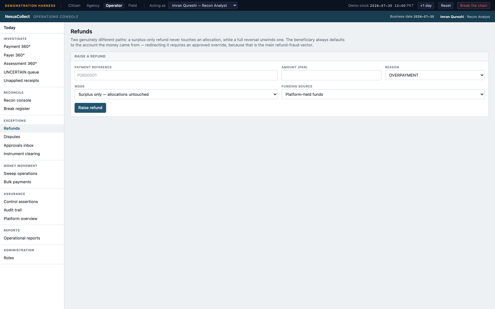

Money going back out, under its own maker-checker pair (`OPS_REFUND_MAKER` proposes,
`OPS_REFUND_APPROVER` approves).

Two paths, and they are genuinely different: a **surplus refund** returns an
overpayment and leaves the allocations alone; a **full-reversal refund** unwinds the
allocations too. The beneficiary defaults to the account the original payment came
from, and changing it requires an approved override — a default that exists because
redirecting a refund is the cleanest way to steal from a collection system.

A refund raised after the money has already been swept to treasury does not silently
undo the sweep. It creates a receivable from the agency, because the cash is no
longer in the platform's account and pretending otherwise would misstate two sets of
books at once.

### Disputes

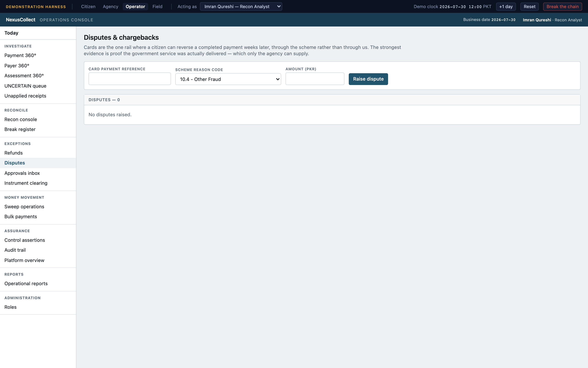

A card scheme forcing a reversal weeks later, through the card network rather than
through the platform. Its own lifecycle — received, evidence submitted, then won or
lost — and its own evidence bundle: the receipt, the resolution trace, the assessment
detail, and the payment's application trace.

A lost dispute posts a real chargeback entry with configurable liability: the
operator, the agency, or shared.

### Approvals inbox

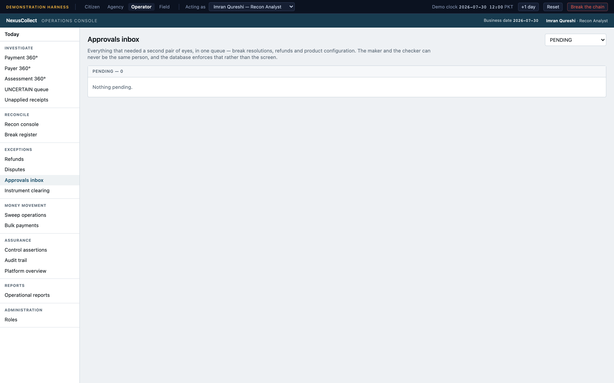

Everything waiting for a second pair of eyes, in one place, with what is being
approved, who proposed it, and when. Maker-checker only works if the checker can
find their queue.

### Instrument clearing

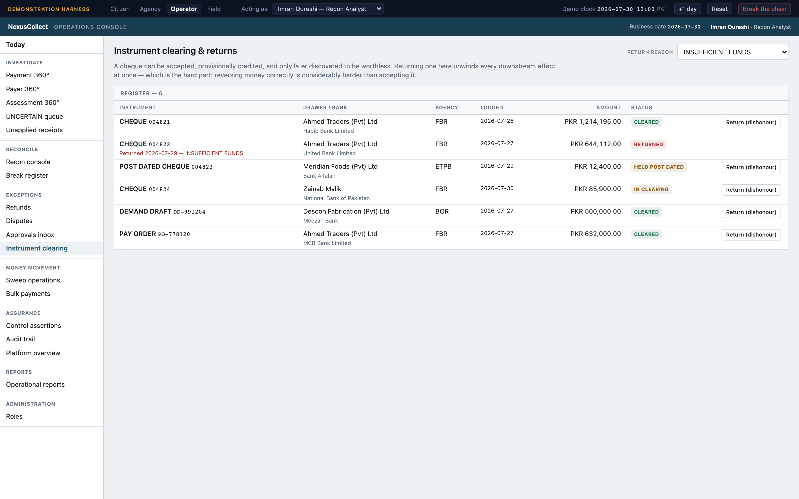

Every cheque, pay order and demand draft in the platform, with its status: in
clearing, held (post-dated), cleared, or returned.

**The dishonour cascade** is here, and it is the demonstration's second signature
moment. Returning a cheque is one action that ripples through six downstream effects,
each of which lands visibly:

1. Every allocation the cheque funded is reversed.
2. Every bill it had settled is un-settled.
3. Every receipt it produced is **voided** — never deleted, and still linked to the
   original.
4. Surcharge resumes from the **original** due date. The bill gets no holiday for the
   period it sat as provisionally paid.
5. The service gate closes again.
6. A dishonour-charge assessment is raised automatically.

The seeded example is instrument `IN-0004`, cheque number `004822` for PKR
644,112.00, returned for insufficient funds: 6 allocations reversed, 3 bills
un-settled, 3 receipts voided, and a new dishonour charge raised.

Watch what happens to the public receipt verification afterwards. A receipt that
verified as **Valid** ten minutes ago now verifies as **Voided**, with an explanation.
That is why the citizen portal makes status the headline of that screen.

---

## Money movement

### Sweep operations

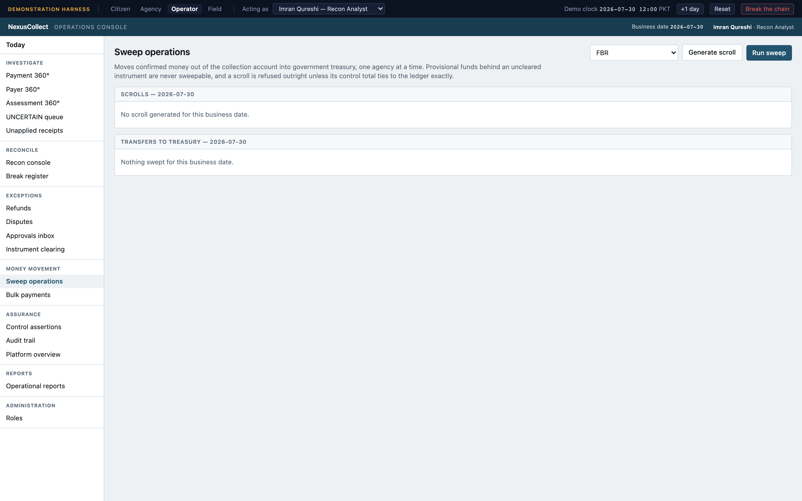

Runs the sweep for an agency and a business date, generates the scroll, and records
treasury's acknowledgement.

`PROVISIONAL_FUNDS_NOT_SWEEPABLE` is enforced here, and it is worth knowing that this
rule was once true only of the seeded data: nothing in the live pipeline ever *set*
money to provisional, so a cheque lodged at a counter would have produced final,
sweepable money. That is now fixed, and proven by a test that lodges a cheque, runs
the sweep, and asserts the money did not move.

Period close lives here too. It is blocked while critical or high breaks are open, and
a closed period cannot be reopened.

### Bulk payments

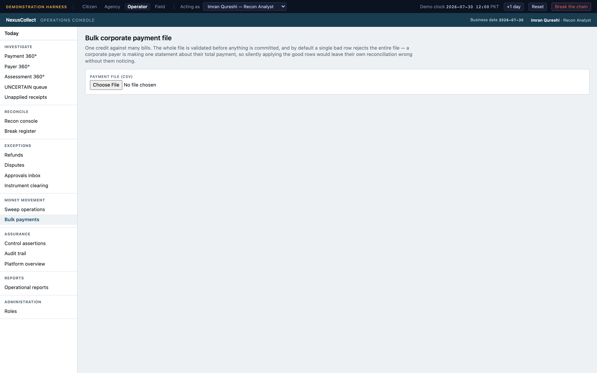

A file of payments from an employer, a bank or an agent network: validate first, then
confirm.

The validation report is the screen's real content — control total, row count, and
per-row errors. And the semantics are strict on purpose: a file with a bad row is
rejected **whole**. Row 13 of the seeded `bulk_payment_input.csv` references an
already-settled bill, and it takes the entire file down with it. Partially applying a
batch file leaves a reconciliation problem that is far more expensive than asking the
sender to fix one row.

---

## Assurance

### Control assertions

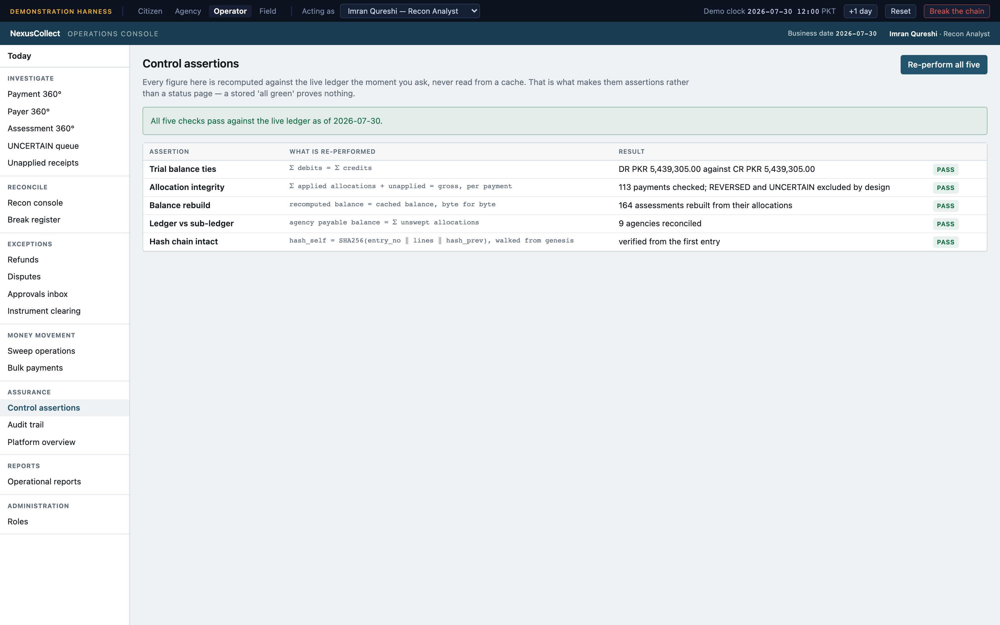

Five checks, re-performed on demand against the live ledger — not cached results:

| # | Check | What it proves |
|---|---|---|
| 1 | Trial balance ties | Every journal entry balances: Σ debits = Σ credits. |
| 2 | Allocation integrity | For every live payment, Σ applied allocations + unapplied = gross. |
| 3 | Balance rebuild | Every cached balance, recomputed from allocations, is byte-identical to the stored value. |
| 4 | Ledger vs sub-ledger | Each agency's payable balance equals the sum of its unswept allocations. |
| 5 | Hash chain intact | Every ledger entry's hash is consistent with the entry before it. |

Check 3 is the one that quietly matters most. Cached balance columns exist for speed,
and this proves they are only ever a cache — throw them away, recompute from the
allocations, and you get the same numbers to the paisa.

Check 5 is the one to demonstrate. Press **Break the chain** in the harness, re-run
the checks, and the hash-chain assertion fails **naming the specific journal entry**
that was altered. Not a general warning: an entry number.

Any system can claim its records are immutable. This one invites you to break one and
then tells you which one you broke. Reset repairs it.

### Audit trail

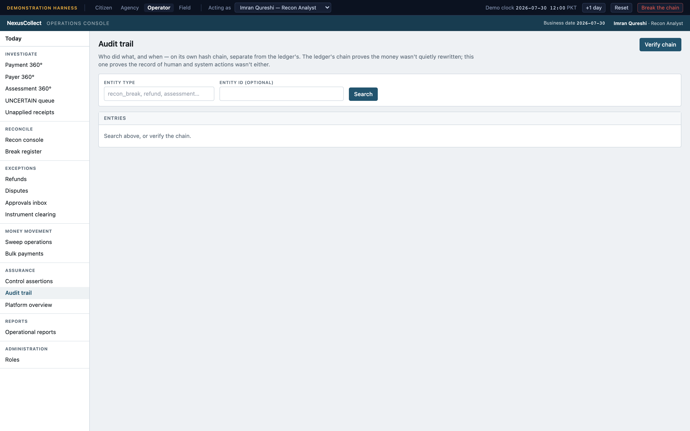

Every state-changing action any user or system took, on its own hash chain,
independent of the ledger's. Searchable by actor, entity, action and date, with the
before-and-after of each change and its own verification.

Two chains rather than one is a deliberate separation: the financial record and the
record of who touched it are different evidence, and they are verifiable
independently.

### Platform overview

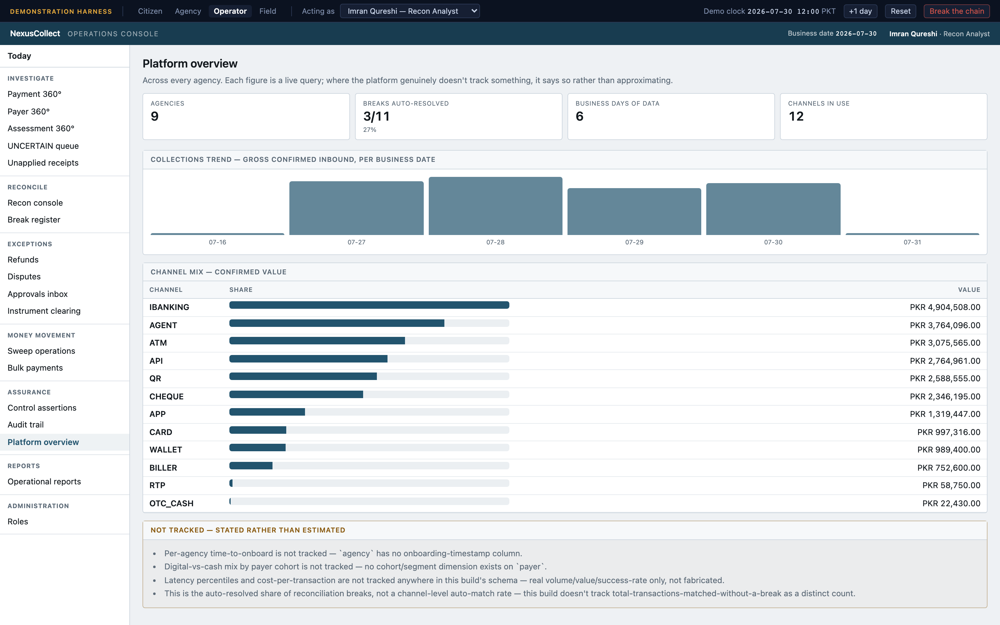

Cross-agency operational health: queue depths, break ageing, cycle and scroll status,
the five controls, channel mix from the real distribution of payments, and
auto-match rate from real reconciliation history.

One metric is deliberately absent. Digital-versus-cash mix by payer cohort is the
single best proxy for whether a digitisation programme is working — and the platform
does not tag cohorts, so it is reported as **not tracked** rather than approximated.
An estimate presented as a measurement is worse than a stated gap.

---

## Reports

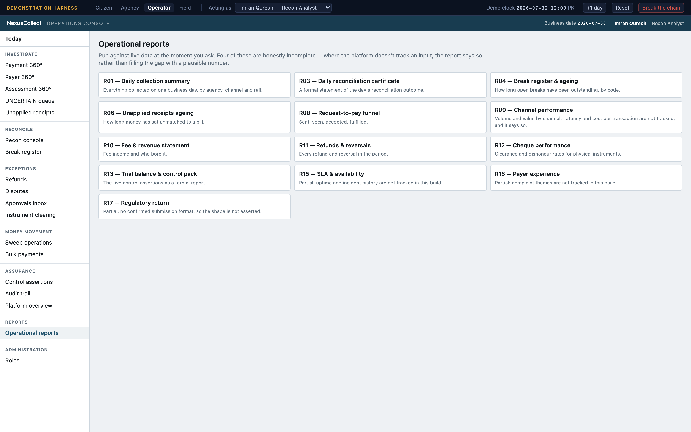

Eighteen operational reports, each a real query against real data. Where a report
cannot be produced honestly, it says which data it would need instead of filling the
space.

---

## Administration

### Roles

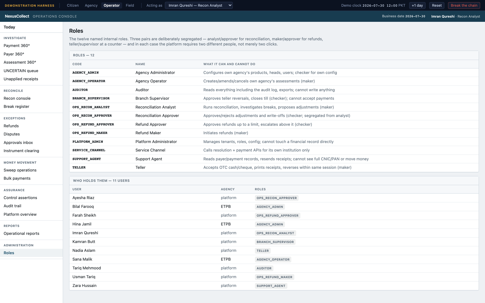

All twelve roles from the specification and what each can and cannot do —
read-only, because this is the screen that answers "who is allowed to do what",
not a place to change it.

The role checks it documents are the ones actually enforced server-side. Four route
groups are gated today: agency configuration to `AGENCY_ADMIN`, break proposal to
`OPS_RECON_ANALYST`, break approval to `OPS_RECON_APPROVER`, and accepting payments to
`TELLER`. The last is a real segregation rather than a technicality — a branch
supervisor cannot accept a payment, because a supervisor who can both take money and
reverse it is not a control.

You can test any of these from the harness in a few seconds: become somebody without
the role and watch the action be refused by the server, not hidden by the interface.

---

*Next: [The field portal](05-field-portal.md). Or return to the
[manual index](README.md).*
