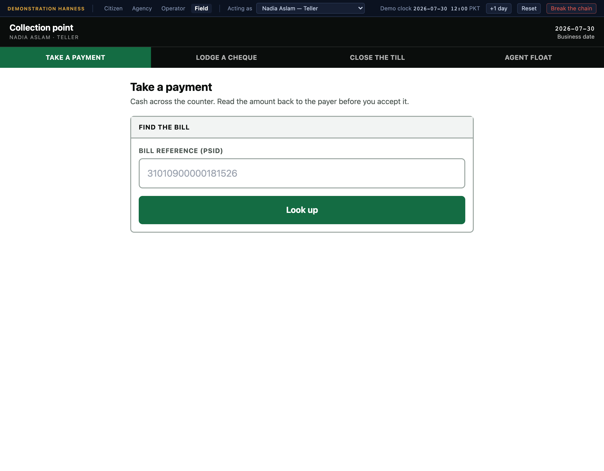
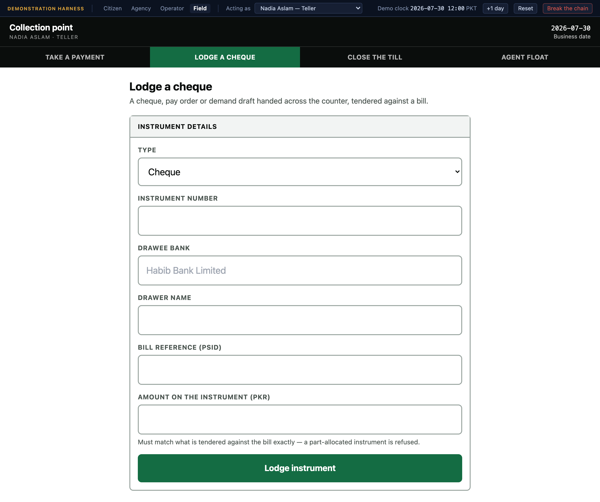
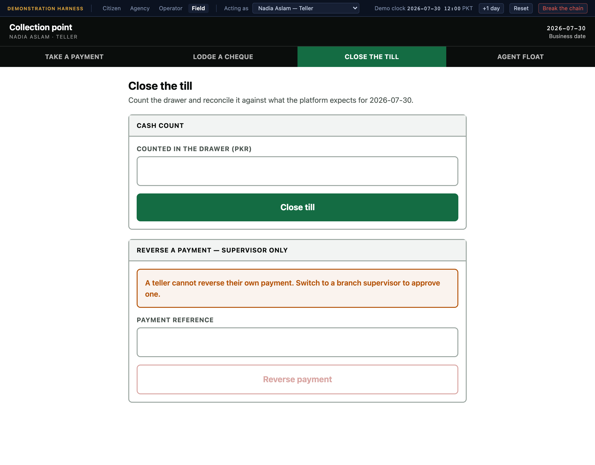
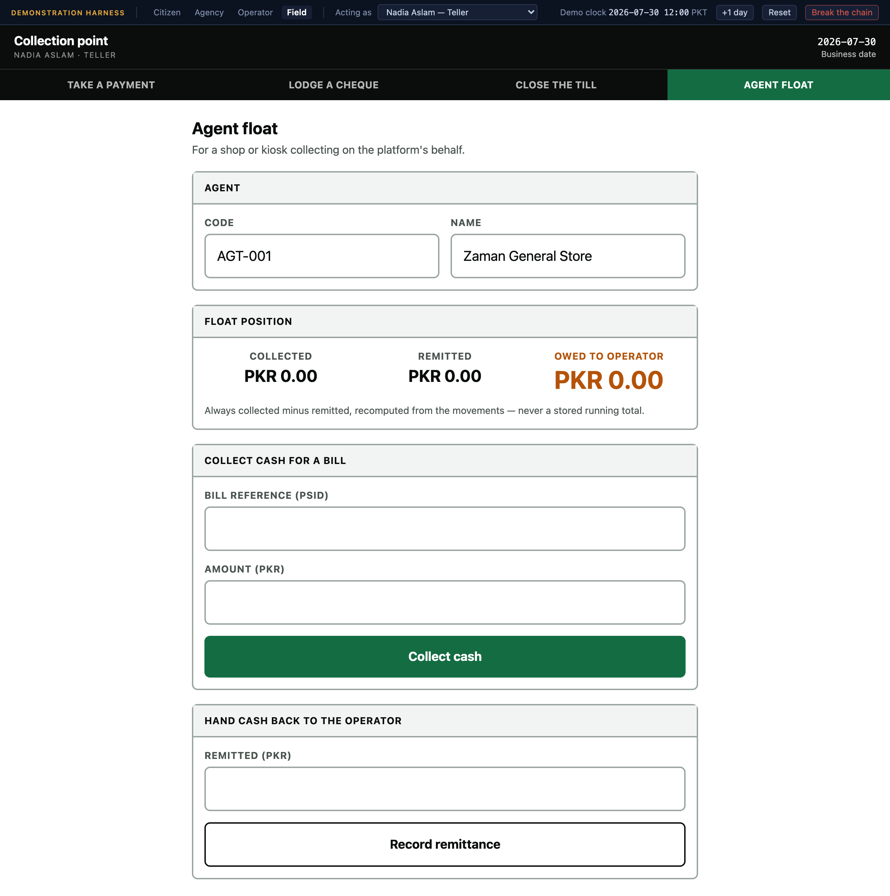

# 5. The field portal

**`field.localhost:5177`** — a bank counter, a branch, or an agent's shop.

Sign in as **Nadia Aslam**, a teller. Four screens: take a payment, lodge a cheque,
close the till, run an agent float.

## Why it looks the way it does

Oversized touch targets, high contrast, one task per screen, and no dense tables
anywhere. This is not a stylistic preference — both of the devices this runs on are
used standing up, often in poor light, usually with somebody waiting on the other
side of the counter. A teller has no time to hunt for the right row.

The header states the two things a teller must never get wrong: who they are, and
what business date they are posting to.

---

## Take a payment

Cash across the counter, in three steps: find the bill by its reference, confirm
what is owed, accept the money.

> Cash across the counter. Read the amount back to the payer before you accept it.

Looking up a bill shows the payer, the product, and the amount due — computed live,
so a surcharge that has accrued since the bill was printed is included. Accepting
the payment runs the same apply pipeline as every other channel: the money is
allocated across the bill's line items by the product's waterfall, the journal
entries are posted, and a receipt is minted with a gapless per-agency receipt
number.

### What the drawer keeps is not what the payer handed over

The teller enters what was **tendered**, and the screen works out the change. What the
platform captures is what the drawer actually keeps.

Somebody paying a PKR 2,480.00 water bill with a round PKR 3,000.00 note has 2,480.00
recorded against the bill and 520.00 handed back. Capturing the tender instead would
overstate the day's collections by the change, leave 520.00 sitting as unapplied money
nobody had paid, and guarantee the till came up short at close by exactly that amount.

Tendering *less* than is owed is a different thing entirely, and treated differently: it
is a genuine partial payment, so the platform records what was actually handed over and
the bill keeps its remaining balance. The rule is that the captured amount is the lesser
of what was tendered and what was owed — so change can never be negative, and a short
payment is never silently rounded up.

It is a small piece of arithmetic that looks right until you reconcile the drawer, which
is why it lives in one tested function rather than in the screen.

Nothing about the cash path is special-cased in the platform's core. The channel is
`CASH` and the rail is `CASH`; the pipeline behind it is identical to the one a bank
app uses. That is the design rule — no channel logic outside the adapters — and this
screen is where it is easiest to see the benefit of it.

### Only a teller can accept money

Accepting a payment is gated to the `TELLER` role. A **branch supervisor** cannot do
it, and this is a real segregation rather than an oversight: a supervisor's job
includes reversing a teller's mistake, and somebody who can both take money and
reverse it is not a control.

Switch the harness to **Kamran Butt** (branch supervisor) and try. The server
refuses, and the refusal comes from the server rather than a hidden button.

---

## Lodge a cheque

A physical instrument accepted at the counter: cheque, post-dated cheque, pay order
or demand draft. Enter its number, its amount, the drawer, and the bills it is
tendered against.

### The credit is provisional, and the screen says so

The money is captured as **provisional**, not final, and the confirmation says it
plainly. Under every one of the platform's three instrument credit policies, money
behind an uncleared instrument is provisional at lodgement — that is what an
instrument *is*. The bank can still take it back.

The consequences are enforced rather than described:

- **It can never be swept to treasury.** The sweep refuses non-final money, every
  time.
- **The receipt says so on its face**, in an unmissable banner rather than a small
  badge: *PROVISIONAL — subject to realisation of the instrument.*

There is one narrowing worth disclosing. The three credit policies differ on service
gating *and* on whether allocation waits for clearing. This build models the first
but not the second: allocation happens at lodgement regardless of policy. That is
stated in the code rather than implied.

### What it refuses

- **A part-allocated instrument.** A cheque must be fully tendered against bills when
  it is lodged. Accepting one with money unaccounted for creates an unapplied balance
  nobody asked for.
- **The same cheque number twice.** Lodging it again would double-credit the payer.
- **Presenting a post-dated cheque.** It is *held* instead, in its own state, until
  its date arrives.

### The thread the cascade follows

Lodgement's one critical job is setting the instrument reference on the payment it
creates. That single link is the only thread the dishonour cascade follows later to
find what to unwind — so if the cheque bounces three days from now, everything that
happens in the [operator portal's cascade](04-operator-portal.md#instrument-clearing)
depends on this screen having got that right.

Worth knowing, because it is the kind of gap that hides well: lodgement did not exist
until this portal was built. The cascade was built first, starting from "the
instrument already exists", which was true of every cheque in the seeded data —
they all come from the loader. No teller could actually accept one.

---

## Close the till

End of shift. The teller counts the drawer, enters what they counted, and the
platform compares it to what it expected.

When the two differ, the difference is **posted to the ledger as a real journal
entry** — an over or a short against its own account — rather than being absorbed
into a rounding line or quietly ignored. The trial balance still ties afterwards,
which is the point: a drawer that is PKR 17,750 over is a fact about the day, and a
system that hides it is not a system anybody should trust with cash.

Closing the same till twice is an idempotent replay. It produces one journal entry,
not two, because the entry's identity is derived from the business date and the till
rather than generated fresh each time.

(This screen returned a server error on any non-zero difference until recently. It
only ever worked when the drawer balanced *exactly* — which skips the posting
entirely — so nothing had caught it. It is fixed, and there are now two regression
tests specifically for the non-zero case.)

Reversing a payment is a **supervisor's** action here, not a teller's, for the reason
above.

---

## Agent float

The branchless-banking channel: an agent in a shop collecting government bills on
the platform's behalf.

An agent holds a **float** — the running balance they owe the platform, which is
collections taken minus cash remitted. This screen collects a payment against a
bill, records a remittance, and shows the outstanding position.

The float is **derived, never cached**. It is computed from the movements every time
it is displayed, so it cannot drift from the transactions that produced it. That is
the same principle the whole platform applies to balances, applied here because an
agent's float is exactly the kind of number that would otherwise be maintained by
increment and slowly go wrong.

The daily float variance report — what the agent should be holding against what they
say they are holding — is the reconciliation an agent network actually runs on.

---

*Next: [Flows and diagrams](06-flows-and-diagrams.md). Or return to the
[manual index](README.md).*
