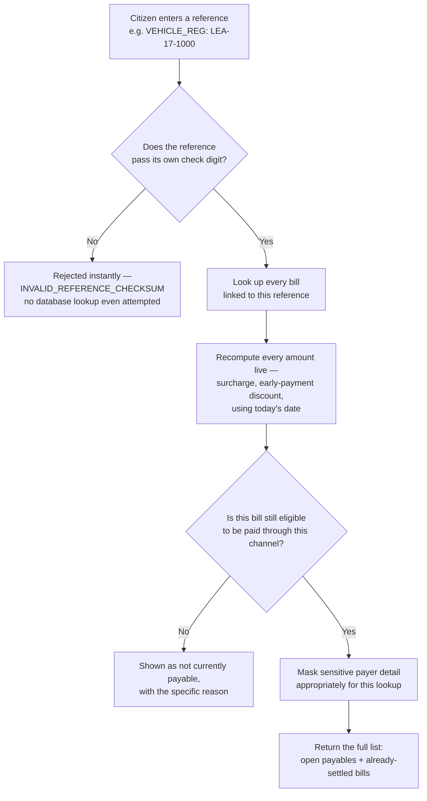
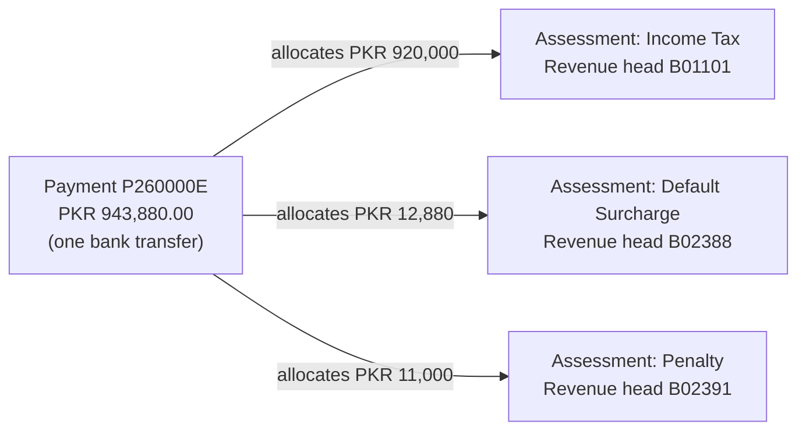
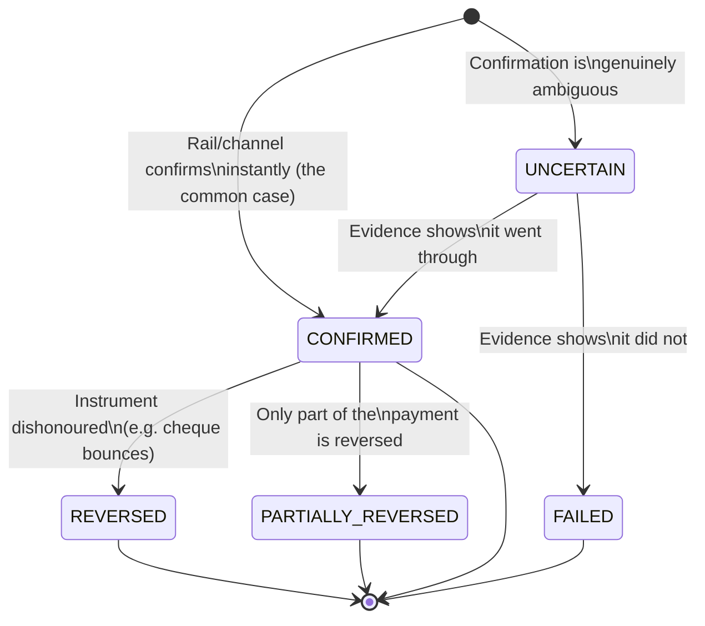
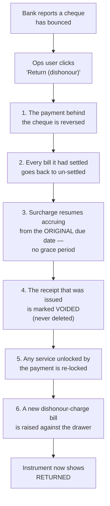
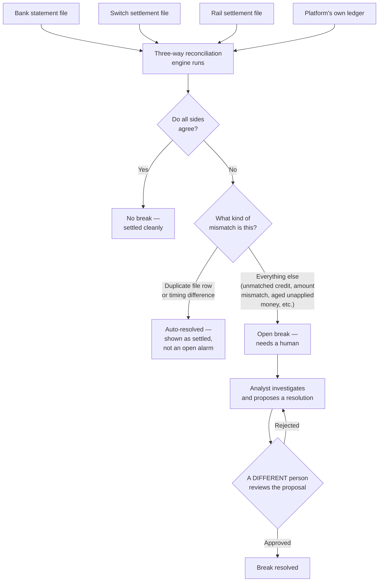
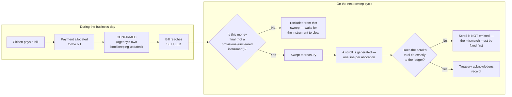
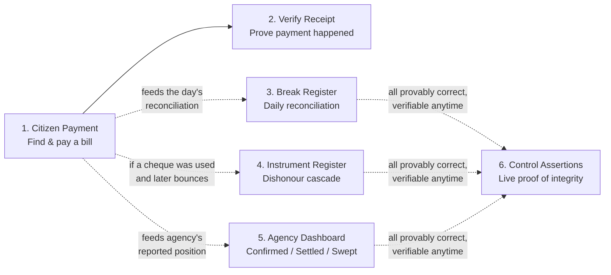

# 6. Flows & diagrams

This document collects the major end-to-end processes described throughout this manual into single visual diagrams, so you can see how the screens connect during a real, complete workflow — not just in isolation.

---

## How a citizen bill lookup actually resolves

This is what happens, in order, every time a reference is entered on [the citizen portal](02-citizen-portal.md). It happens in well under a second, but it is not a single step — several checks and lookups happen in a fixed sequence:

**Why the check-digit step happens first, before any database lookup:** a mistyped reference is extremely common, and catching it instantly — with zero database work — means a typo is never confused with "this bill doesn't exist," and it keeps the whole lookup fast even under heavy load.

---

## Assessment, Payment, and Allocation — how they connect

This expands on [the core concept](00-concepts.md#2-assessment-payment-and-allocation-are-three-separate-things) with a concrete, real example: the multi-head payment `P260000E` shown on the [agency portal](03-agency-portal.md) and [Payment 360°](04-operator-portal.md).

One single payment, from the payer's point of view, correctly funds three completely separate obligations — potentially spanning different bills and even different agencies — with the platform handling the split automatically according to each agency's configured allocation rules.

---

## The life of a payment

Every payment moves through a defined set of states. This diagram shows the possible paths — most payments take the simple, direct route down the left; the right-hand branches exist specifically for the harder real-world cases this manual covers.

- **`CONFIRMED`** is where the large majority of payments land, and stay, permanently.
- **`UNCERTAIN`** (see [the UNCERTAIN Queue](04-operator-portal.md)) is a temporary holding state — every uncertain payment eventually resolves to either `CONFIRMED` or `FAILED`, based on real evidence, never a guess.
- **`REVERSED`** / **`PARTIALLY_REVERSED`** happen after a `CONFIRMED` payment turns out to be based on money that was never actually good — the [cheque dishonour cascade](04-operator-portal.md) is the clearest example.

---

## The cheque dishonour cascade, step by step

This is the full sequence behind [returning an instrument](04-operator-portal.md) on Screen 4 — six distinct effects, triggered by one action, always in this order:

Every one of these six effects is visible and traceable — nothing about a dishonour happens silently. See [Instrument Register](04-operator-portal.md) for what each effect looks like on screen.

---

## Reconciliation: from source files to a resolved break

This shows the full path a mismatch takes, from the moment the day's source files arrive to the moment it's resolved — spanning [the Break Register](04-operator-portal.md) and [Recon Console](04-operator-portal.md).

The maker-checker step (a different person must approve) is not optional or bypassable — it is the same rule described in [the introduction](00-concepts.md#6-maker-checker-separation-of-duties), enforced here specifically for reconciliation breaks.

---

## The settlement and sweep cycle

This shows how money moves from being confirmed against a bill to actually reaching government treasury — the mechanics behind the three [agency portal](03-agency-portal.md) headline figures.

The **"tie exactly or refuse to emit"** rule is deliberate: the platform will never hand treasury a settlement document it cannot itself prove is correct to the paisa.

---

## Where each screen sits in the citizen's journey

A last, simpler diagram tying the six primary screens back to the actual sequence a citizen (and the staff supporting them) experience, end to end:

## What to do next

For quick definitions of any term used across these diagrams (waterfall, scroll, revenue head, and more), see the [Glossary](07-glossary.md).
