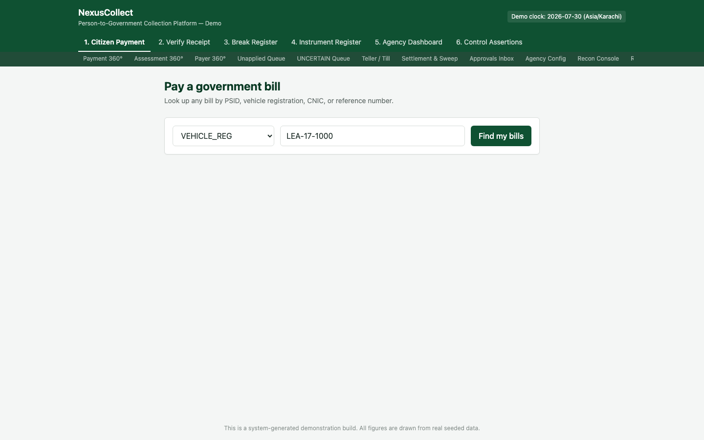
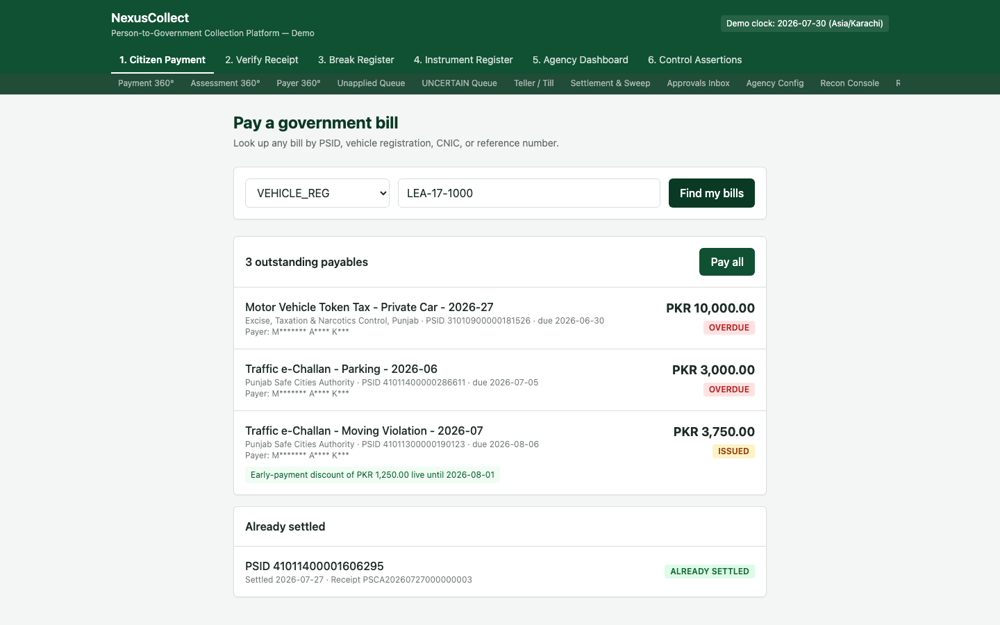
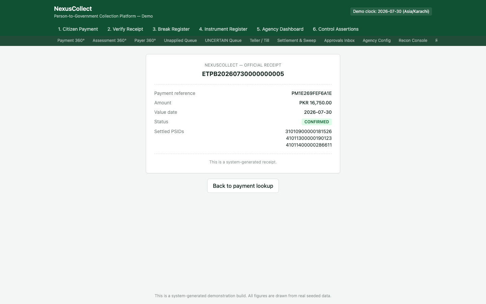

# 1. Screen 1 — Citizen Payment

**Who this is for:** citizens paying a bill, and any front-line staff (a teller, a call-centre agent) helping a citizen pay on their behalf. No login is required.

**What it does:** finds every bill owed by a person or property, across every government agency, using any reference the person has to hand — then lets them pay it in one action and receive a real receipt.

## Where to find it

This is the platform's home screen — tab **"1. Citizen Payment"** in the top navigation, or the root URL of the site.

## Step 1 — Choose a reference type and enter the value

At the top of the screen are two fields:

1. A **reference type** dropdown (in this example, `VEHICLE_REG` — a vehicle registration number). The platform supports numerous reference types beyond vehicle registration, including:
   - **PSID** — the bill's own canonical ID
   - **CNIC** — national ID number
   - **Vehicle registration**
   - **Case / challan number**
   - **Property ID**
   - **QR code payload** (scanned from a printed challan)
   - and several more specialised types used by specific agencies
2. A **value** field, where you type or scan the actual reference (here, `LEA-17-1000`).

You do not need to know which agency issued a bill, or how many bills exist against a reference — the lookup handles all of that for you.

> **Why does this matter?** A citizen should never need to know their own PSID, remember which of several agencies they owe money to, or perform separate lookups per agency. One reference, one search, the complete picture.

Click **"Find my bills."**

## Step 2 — Review what's owed

The result is split into two groups:

### Outstanding payables

Every bill still owed against this reference, regardless of which agency issued it. In this example, the single vehicle lookup returned bills from **two entirely different government bodies**:

| Bill | Agency | Amount | Status |
|---|---|---|---|
| Motor Vehicle Token Tax — Private Car, 2026-27 | Excise, Taxation & Narcotics Control, Punjab | PKR 10,000.00 | **OVERDUE** |
| Traffic e-Challan — Parking, 2026-06 | Punjab Safe Cities Authority | PKR 3,000.00 | **OVERDUE** |
| Traffic e-Challan — Moving Violation, 2026-07 | Punjab Safe Cities Authority | PKR 3,750.00 | ISSUED, with a **live early-payment discount of PKR 1,250.00** until 2026-08-01 |

A few details worth noticing:

- Each row shows the exact **PSID**, the **due date**, and a **status badge** (`OVERDUE` or `ISSUED`). `OVERDUE` bills have already passed their due date; whether a surcharge applies depends on the specific product's rules, but nothing here is hidden from you.
- The moving-violation challan shows a **live early-payment discount**. This figure is calculated fresh, at the moment you look it up — it is never a stale, pre-computed number. If you looked this bill up again tomorrow, the discount would be smaller or gone entirely if the discount window had closed.
- The payer's name is shown partially masked (`M******* A**** K***`) — this is deliberate privacy protection; the full name is not needed to complete the payment and is not exposed to an anonymous, unauthenticated lookup.

### Already settled

Any bill matched by the same reference that has **already been fully paid** is shown here — not hidden, and not shown as an error. It carries its own settlement date and its real receipt number (`PSCA20260727000000001` in this example) right inline.

> **Why does this matter?** If a citizen paid a bill last week and tries to look it up again — perhaps out of habit, or because they lost their old receipt — the very worst thing the platform could do is either (a) show it as still owing, risking a duplicate payment, or (b) show a generic "not found" that leaves the citizen unsure whether they actually paid. Showing the real settlement fact, with the real receipt reference, resolves the question immediately and prevents a duplicate payment before it can even be attempted.

## Step 3 — Pay

Click **"Pay all"** to pay every outstanding bill shown, in one action.

> This demonstration build's Citizen Payment screen supports paying **all** outstanding bills for a reference in a single action. (A production deployment could equally offer per-bill selection; this build's citizen-facing screen is deliberately kept to the single "pay everything you owe" flow, which is the common case and the fastest path for a citizen.)

The result is a real, official receipt:

| Field | Value |
|---|---|
| Receipt number | `ETPB20260730000000005` |
| Payment reference | `PMA5C1078B7476` |
| Amount | PKR 16,750.00 |
| Value date | 2026-07-30 |
| Status | **CONFIRMED** |
| Settled PSIDs | the bill(s) this payment discharged |

This single payment correctly discharged bills belonging to **more than one agency**, from a single citizen action, in a single transaction — the platform's [Allocation mechanism](00-introduction-and-concepts.md#2-assessment-payment-and-allocation-are-three-separate-things) is what makes this possible without the citizen ever needing to think about it.

> **What if the payment can't be confirmed immediately?** Some payment channels (particularly bank rails) don't always confirm a transaction the instant it's submitted. In that case, the payment is placed into the `UNCERTAIN` state rather than being shown to the citizen as a failure. See [the Introduction](00-introduction-and-concepts.md#4-uncertain-is-a-real-first-class-state--not-a-failure) and the [UNCERTAIN Queue](07-back-office-screens.md#uncertain-payments-queue) in the back-office screens for how this is resolved.

## What to do next

- To check whether a receipt is genuine (e.g. if you're the recipient of one, not the payer), go to [Screen 2 — Receipt & Verification](02-receipt-and-verification.md).
- If a bill isn't showing up, or a citizen believes an amount is wrong, that's typically an [Assessment 360°](07-back-office-screens.md#assessment-360) lookup for an ops user, not something fixable from this screen.

## Frequently asked questions

**Q: Can a citizen pay just one bill instead of all of them?**
A: This demonstration build's citizen screen offers "pay all" as its single payment action. If a citizen only wants to pay one of several bills, a teller can process that selectively via the [Teller / Till](07-back-office-screens.md#teller--till) back-office screen.

**Q: What happens if the same reference is looked up twice in a row?**
A: Nothing changes the second time unless something was actually paid in between — the lookup is a pure, side-effect-free read. Looking up a bill never creates a record, reserves anything, or has any effect on the bill itself.

**Q: Why is the payer's name partially masked?**
A: This lookup requires no login, so it is, by definition, available to anyone with the reference. Showing a masked name (enough to confirm "yes, this looks like my bill") while withholding the full name protects the payer's privacy without preventing them from confirming they've found the right bill.

**Q: Does the discount amount ever go stale?**
A: No — it is recalculated live on every single lookup, using the platform's fixed [demo clock](00-introduction-and-concepts.md#the-demo-clock) (or the real clock, in production). You will never see a discount that has actually expired still being offered.
