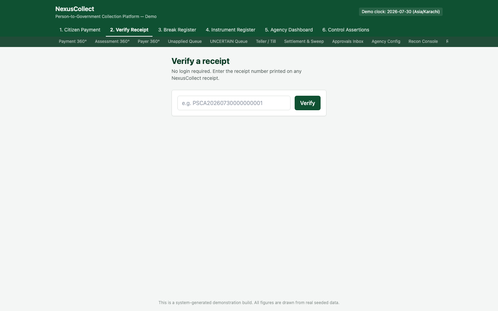
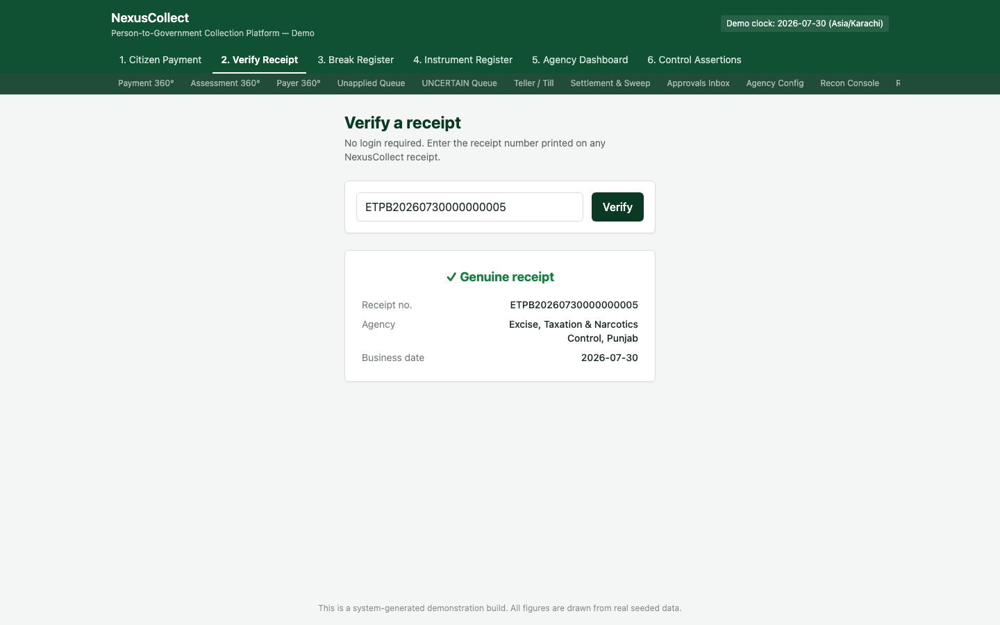
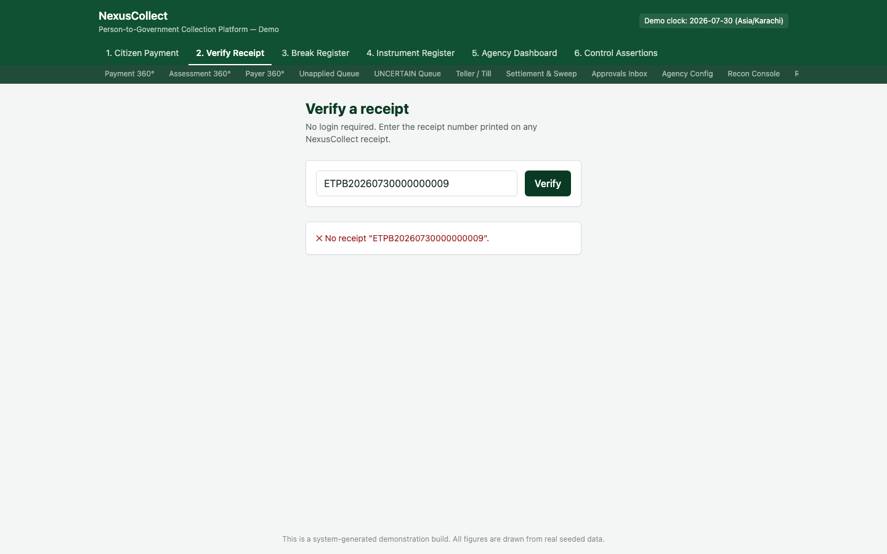

# 2. Screen 2 — Receipt & Verification

**Who this is for:** anyone holding a NexusCollect receipt — the payer, a bank, an auditor, or a government agency — who needs to confirm it is genuine. No login is required.

**What it does:** looks up a receipt by its printed number and confirms whether it is real, tampered with, or doesn't exist — entirely independently of who's asking.

## Why this screen exists

A receipt is only useful as proof of payment if it can be **independently verified** by someone who wasn't there when it was issued — a bank confirming a customer's proof of tax payment, an auditor sampling receipts for a compliance check, or simply the payer double-checking their own paperwork months later. This screen (and the underlying receipt-signing mechanism behind it) exists specifically so that verification never depends on trusting the person presenting the receipt.

## Where to find it

Tab **"2. Verify Receipt"** in the top navigation.

## Step 1 — Enter the receipt number

Type or scan the receipt number exactly as printed (for example, `ETPB20260730000000005` — the receipt we generated in [Screen 1](01-citizen-payment.md)). Click **"Verify."**

## Step 2 — Read the result

### A genuine receipt

A real, unaltered receipt returns a clear **"✓ Genuine receipt"** confirmation, along with:

| Field | What it tells you |
|---|---|
| Receipt no. | The exact receipt number you searched for, confirmed to exist |
| Agency | Which government agency this receipt was issued on behalf of |
| Business date | The date the payment was recorded against (see [two-sided time](09-glossary.md#value-date-vs-created-at) in the glossary — this is the *business* date, not necessarily the exact clock time the system processed it) |

Deliberately, this result shows only what's needed to confirm authenticity — it does not expose the full payer name, full amounts, or other sensitive detail to an anonymous check. (A full, detailed receipt with every line item is available to the payer themselves, or to authorised staff, through the [Payment 360°](07-back-office-screens.md#payment-360) screen.)

### A receipt that doesn't check out

If even a single digit of the receipt number is altered, the result is unambiguous: **"✗ No receipt \"...\"."** There is no partial match, no "close enough," and no ambiguity — either the receipt number corresponds to a real, unmodified receipt, or it doesn't.

> **Why does a single wrong digit matter so much?** This is the whole point of the mechanism: a forged or altered receipt number must fail verification completely, every time, with no exceptions. A verification system that ever accepted a "close" match would be useless as proof of anything.

## How this actually works, in plain terms

Every receipt the platform issues is **digitally signed** at the moment it's created, using a cryptographic signature tied to the receipt's exact contents (amount, payer, date, agency — everything). Verifying a receipt means re-checking that signature against the receipt's contents as stored in the platform. Change even one character of the receipt number or its contents, and the signature check fails — there is no way to produce a "valid-looking" forged signature without knowing the platform's private signing key, which never leaves the system.

This same signature can also be checked **completely offline** — for example, by scanning a QR code printed on a physical receipt and validating it locally, with no network call to NexusCollect at all. This is intentional: a receipt should be provably genuine even to someone standing somewhere with no internet connectivity, holding nothing but the piece of paper.

## What to do next

- If you need the *complete* detail behind a payment (not just a genuineness check), use [Payment 360°](07-back-office-screens.md#payment-360) — that requires being an authorised internal user, unlike this screen.
- If a receipt shows as genuine but the amount looks wrong to the payer, that's an agency/finance question, not a verification-screen question — the amount shown here is exactly what was recorded at the time of payment.

## Frequently asked questions

**Q: Does verifying a receipt require the payer's permission, a login, or any special access?**
A: No. Verification is deliberately open to anyone holding a receipt number — that's what makes it useful as independent proof.

**Q: Can a receipt be verified after the bill it relates to has been amended or refunded?**
A: Yes, but the receipt's own status will reflect that — for example, a receipt tied to a payment that was later reversed (see the [Instrument Register](04-instrument-register.md)) is marked **voided**, never silently deleted or hidden. The historical fact that a payment was once received and receipted is preserved permanently.

**Q: What if I don't have the receipt number, only a vague description of the payment?**
A: This screen specifically requires the receipt number. To search by other details (payer name, amount, date range), an authorised operations user can use [Payment 360°](07-back-office-screens.md#payment-360) or [Payer 360°](07-back-office-screens.md#payer-360) instead.
