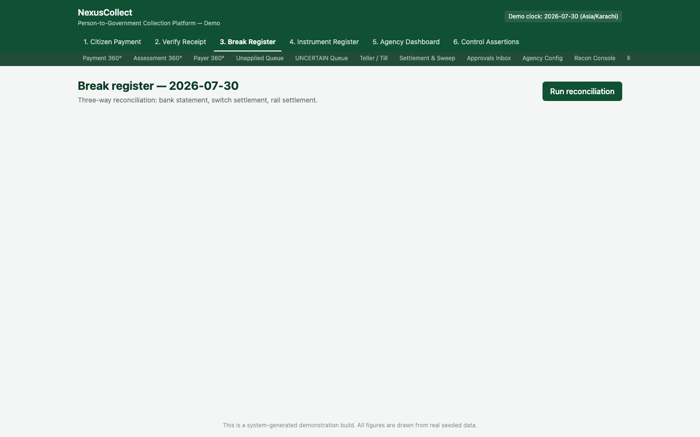
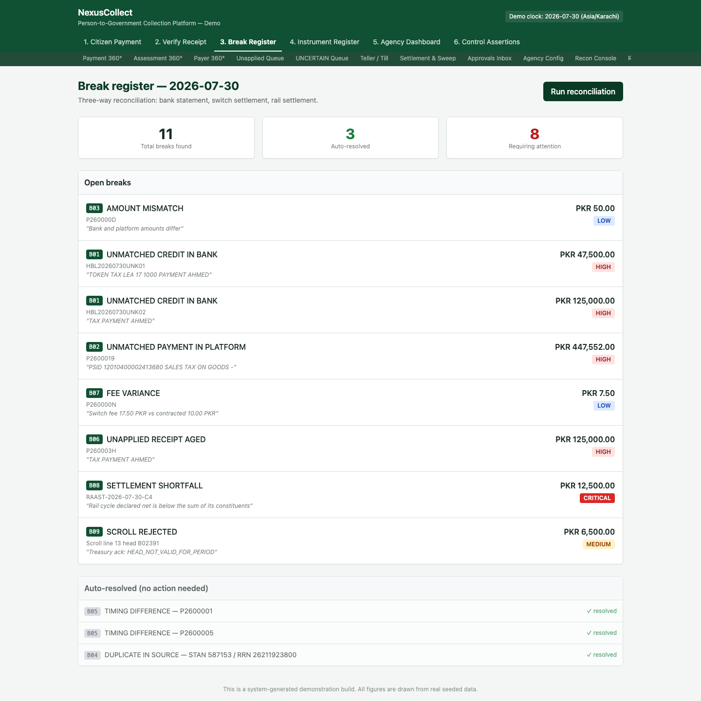

# 3. Screen 3 — Break Register

**Who this is for:** reconciliation analysts and reconciliation approvers.

**What it does:** runs a daily three-way reconciliation — the platform's own ledger, the bank's statement, the payment switch's settlement file, and the payment rail's settlement file — and surfaces every mismatch ("break") it finds, so it can be investigated, resolved, and signed off.

## Why this screen exists

Money moves through several independent systems before it's truly "collected": the citizen's bank, the payment switch or rail that routes the transaction, and finally the government's own bank account. Each of those systems produces its own record of what happened. In the real world, these records don't always agree perfectly — a transaction fee is deducted before the money lands, a file arrives late, a bank credit shows up with no reference the platform can automatically match. This screen is where those disagreements ("breaks") are found and worked through, every single business day, so that nothing is ever silently missed.

## Where to find it

Tab **"3. Break Register"** in the top navigation.

## Step 1 — Run reconciliation for the day

The screen shows the business date being reconciled (here, **2026-07-30**) and a description of what it checks: *"Three-way reconciliation: bank statement, switch settlement, rail settlement."* Click **"Run reconciliation."**

> In a live deployment, this step runs automatically once the day's bank statement and settlement files are available — it's a manual button here purely so the demonstration can show the result on demand.

## Step 2 — Review what was found

The top of the screen shows three summary figures:

| Figure | Meaning |
|---|---|
| **Total breaks found** | Every mismatch identified across all three source files, for this business date |
| **Auto-resolved** | Breaks the platform was able to resolve on its own, using clear, deterministic rules (see below) |
| **Requiring attention** | Breaks that genuinely need a human analyst to look at them |

### The breaks that resolve themselves

Not every mismatch needs a person. Two specific, narrow categories are resolved automatically, because the correct resolution is unambiguous:

- **Duplicate rows in a source file** — if the same transaction appears twice in a settlement file (a known, mechanical filing error on the source system's side), the duplicate is recognised and set aside automatically.
- **Timing differences** — a transaction that the platform's own ledger and the bank's statement both agree happened, but which crossed the cut-off at slightly different moments (e.g. one system recorded it just before midnight, the other just after), is reconciled automatically once both records are confirmed to refer to the same transaction.

These are shown in the register too, but they never appear as open, unresolved alarms — they read as *settled facts*, not outstanding problems.

### The breaks that need a person

Everything else lands in the **open breaks** list, each carrying a short code, a description in plain English, the source reference, the amount, and a severity:

| Code | Type | Example from this dataset | Severity |
|---|---|---|---|
| B01 | Unmatched credit in bank | A bank credit with narrative *"TOKEN TAX LEA 17 1000 PAYMENT AHMED"* that the platform can't automatically tie to a specific bill | HIGH |
| B01 | Unmatched credit in bank | A second, similarly unmatched bank credit, narrative *"TAX PAYMENT AHMED"* | HIGH |
| B02 | Unmatched payment in platform | The platform recorded a payment the bank statement doesn't show yet | HIGH |
| B03 | Amount mismatch | The bank and the platform agree a payment happened, but disagree on the exact amount (here, by PKR 50.00) | LOW |
| B06 | Unapplied receipt aged | Money has been sitting **unapplied** (not yet linked to any bill) for long enough that it now needs manual attention rather than waiting for automatic matching | HIGH |
| B07 | Fee variance | The switch deducted a fee that doesn't match the contracted rate (PKR 17.50 charged vs. PKR 10.00 contracted) | LOW |
| B08 | Settlement shortfall | A settlement cycle's net total came in lower than what its individual constituent transactions should sum to | CRITICAL |
| B09 | Scroll line rejected | Treasury rejected one line of a submitted scroll (see [the settlement/sweep flow](08-flows-and-diagrams.md#settlement-and-sweep-cycle)) — the money is already banked, this is a filing/classification issue, not a missing-cash issue | MEDIUM |

Notice that **B09 reads differently from the others** even though it's a genuine open break: its description makes clear the money itself isn't missing — it's a paperwork classification problem on an already-settled amount. This distinction matters enormously to whoever is triaging the register: a CRITICAL settlement shortfall (B08) needs urgent attention because real cash may not reconcile; a MEDIUM scroll rejection (B09) needs correction but isn't a signal that money has gone missing.

## What an analyst does with an open break

For each open break, an analyst:

1. **Investigates** — using the source reference (narrative text, transaction ID) to work out what actually happened.
2. **Proposes a resolution** — e.g. "this bank credit matches assessment PSID 12345, apply it there," or "this is a genuine duplicate, discard it."
3. Submits the proposal for review.

A **different person** (the approver) must then review and either approve or reject that proposal — this is [maker-checker](00-introduction-and-concepts.md#6-maker-checker-separation-of-duties) enforced by the system itself, not just a policy. The same user account can never both propose and approve the same break.

## What to do next

- If a break involves a specific payment, cross-reference it in [Payment 360°](07-back-office-screens.md#payment-360) to see its full history before proposing a resolution.
- Ops staff working the day-to-day reconciliation queue in detail should also see the [Recon Console](07-back-office-screens.md#recon-console) in the back-office screens.
- To understand exactly where the source files (bank statement, switch settlement, rail settlement) fit into the bigger settlement picture, see [Flows & Diagrams](08-flows-and-diagrams.md).

## Frequently asked questions

**Q: Can the same person investigate and approve a break?**
A: No. The system enforces that the approving user must be different from the proposing user — this cannot be bypassed by policy exception, because it's a database-level rule, not just a procedural guideline.

**Q: What happens if reconciliation is run twice for the same day?**
A: Running it again does not create duplicate breaks or double-count anything already found — it's safe to re-run.

**Q: Why does a LOW-severity break like B03 (a PKR 50 amount mismatch) still need a person, when duplicates and timing differences resolve automatically?**
A: Automatic resolution is reserved for cases where the *correct* resolution is unambiguous and mechanical. An amount mismatch could have several different real explanations (a fee deducted at source, a genuine data-entry error, a currency rounding difference) — distinguishing between them requires judgement, even though the amount involved is small.

**Q: Does an unresolved CRITICAL or HIGH break block anything else?**
A: Yes — the platform will not allow an accounting period to be closed while a CRITICAL or HIGH severity break remains open. See [Settlement & Sweep](07-back-office-screens.md#settlement--sweep) for more.
