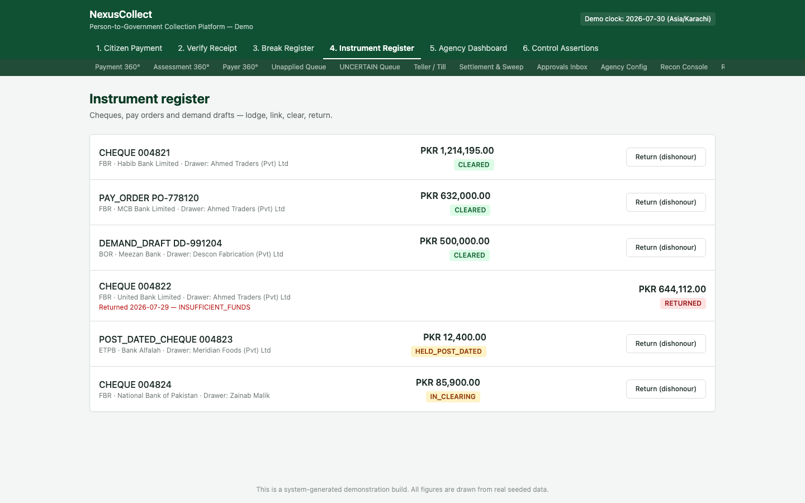
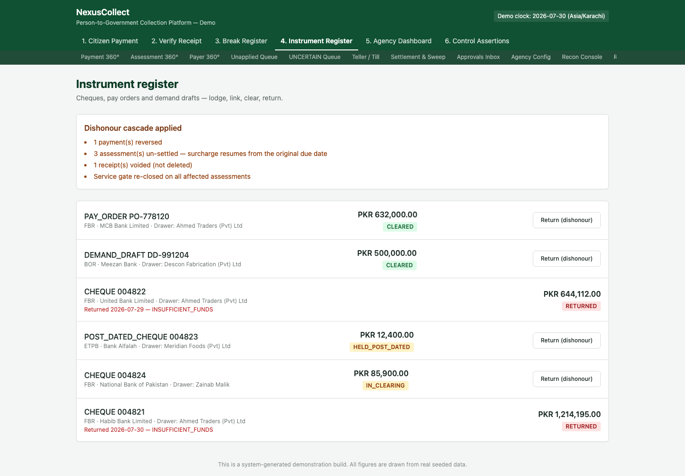

# 4. Screen 4 — Instrument Register

**Who this is for:** operations and teller staff who handle physical payment instruments — cheques, pay orders, and demand drafts.

**What it does:** tracks every physical instrument through its full lifecycle (lodged → clearing → cleared, or lodged → returned), and — when a cheque bounces — carries out the full, multi-step reversal this triggers, visibly and traceably.

## Why this screen exists

Unlike a bank transfer or a card payment, a cheque (or pay order, or demand draft) can be accepted, provisionally credited, and only *later* discovered to be worthless — because the drawer's account had insufficient funds, or the cheque was stopped, or any number of other real-world reasons banks return instruments unpaid. When that happens, every downstream effect of having provisionally accepted that money has to be **undone correctly**: the bill that looked paid needs to become unpaid again, any receipt that was issued needs to be voided, and the citizen's original obligation (including any surcharge that would otherwise have been accruing) needs to resume exactly as if the cheque had never been provisionally accepted — no grace period for the time it sat in limbo.

## Where to find it

Tab **"4. Instrument Register"** in the top navigation.

## Step 1 — Review lodged instruments

Every physical instrument lodged against a government agency appears here, with:

| Field | Example |
|---|---|
| Instrument type & number | `CHEQUE 004821`, `PAY_ORDER PO-778120`, `DEMAND_DRAFT DD-991204` |
| Agency, bank, and drawer | `FBR · Habib Bank Limited · Drawer: Ahmed Traders (Pvt) Ltd` |
| Amount | e.g. PKR 1,214,195.00 |
| Status | `CLEARED`, `IN_CLEARING`, `HELD_POST_DATED`, or `RETURNED` |

The status badges tell you exactly where each instrument sits in its lifecycle:

- **`IN_CLEARING`** — lodged, awaiting the bank's clearing cycle to confirm.
- **`HELD_POST_DATED`** — a post-dated cheque, deliberately held and not yet presented for clearing.
- **`CLEARED`** — confirmed good; the money behind it is now final.
- **`RETURNED`** — the instrument bounced. You can see a real historical example of this in the list already: `CHEQUE 004822`, returned 2026-07-29 for `INSUFFICIENT_FUNDS`.

## Step 2 — Return (dishonour) an instrument

Every instrument that isn't already returned has a **"Return (dishonour)"** button. Clicking it tells the system the bank has bounced this instrument, and triggers the **dishonour cascade**.

A banner appears summarising exactly what happened, in plain terms:

- **1 payment(s) reversed** — the payment this cheque represented is unwound.
- **3 assessment(s) un-settled — surcharge resumes from the original due date** — every bill this cheque had paid off goes back to its pre-payment state, and critically, any surcharge calculation resumes as though the cheque episode never happened. The citizen does not get a "grace period" for the time the bad cheque sat in the system looking like good money.
- **1 receipt(s) voided (not deleted)** — the receipt that was issued when the cheque was provisionally accepted is marked **voided**, permanently. It is never removed from the record — a voided receipt still exists, still shows its original detail, and is now flagged as no longer valid proof of payment.
- **Service gate re-closed on all affected assessments** — if paying these bills had unlocked some downstream service (e.g. a vehicle registration renewal, a licence issuance), that unlock is revoked. A service that depends on a bill being paid should not remain unlocked once the payment behind it turns out to be worthless.

The instrument itself now shows `RETURNED`, with the date and reason (`INSUFFICIENT_FUNDS` in this example).

> A seventh effect, not always visible in a single screenshot: the platform also automatically raises a **new dishonour-charge assessment** — a fresh bill, for the instrument's own recorded dishonour fee — against the same drawer. Bouncing a cheque isn't free; the fee for doing so is itself a real, trackable bill.

## Why this matters more than it might first appear

This is one of the platform's two "signature" demonstrations of correctness, because it proves something that's easy to get wrong in a simpler system: **reversing money correctly is much harder than accepting it.** A naive implementation might simply flip a status flag from "paid" to "unpaid" — but that would silently orphan the receipt, leave any unlocked service incorrectly unlocked, and (worst of all) potentially let the citizen benefit from a surcharge-free grace period they should never have received. This screen makes all six-plus effects visible precisely so nothing about a dishonour is ever silent or partial.

## What to do next

- To see the full financial trail behind a specific reversed payment (including the ledger entries this cascade posted), use [Payment 360°](07-back-office-screens.md#payment-360).
- If the dishonour affects an agency's reported figures, check the [Agency Dashboard](05-agency-dashboard.md) — confirmed and settled totals will have dropped to reflect the reversal.
- To verify the reversal didn't break the books, run the checks on [Control Assertions](06-control-assertions.md) — they will still all pass after a dishonour, because the reversal is itself a correctly balanced, ledger-consistent operation, not a workaround.

## Frequently asked questions

**Q: Can a returned instrument be un-returned (reinstated) if the return was reported in error?**
A: This screen models the return as a real-world, one-way event (a bank has told the platform the instrument bounced) — the same way a real bank would not simply "undo" a returned cheque notice. If a return was reported in error, this is a case-by-case operational and legal question outside the scope of this screen, handled through the refund/dispute mechanisms in the back-office screens rather than by silently reversing the reversal.

**Q: Does the dishonoured citizen lose the surcharge-free window they might have otherwise had?**
A: Yes, specifically and deliberately. Surcharge resumes accruing from the bill's **original** due date, not from the date the cheque was returned — the time the bad cheque sat in the system looking like good money is not treated as a grace period.

**Q: What happens to a receipt that's voided — does the citizen need to do anything with their paper copy?**
A: The receipt remains permanently in the record as voided (never deleted), so anyone verifying it later (via [Screen 2](02-receipt-and-verification.md)) would see its current, voided status rather than being falsely told it's still a valid proof of payment.

**Q: Is a dishonour charge assessment always raised?**
A: Only when the instrument itself carries a recorded dishonour fee amount and belongs to an agency configured to charge one — the amount is always the instrument's own real recorded figure, never an invented or estimated number.
