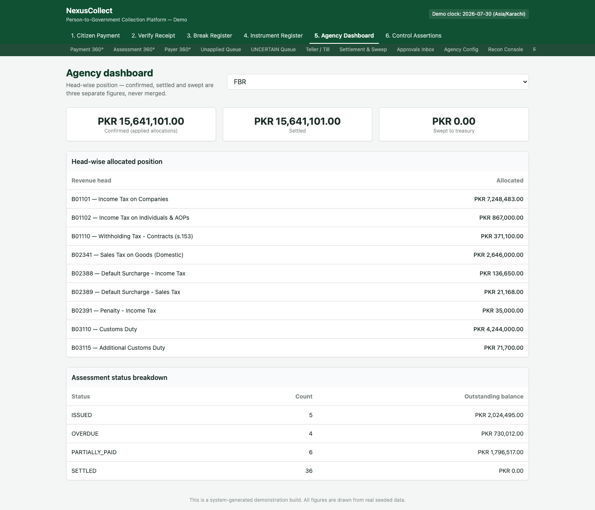

# 5. Screen 5 — Agency Dashboard

**Who this is for:** agency finance officers and anyone who needs a trustworthy, top-level view of a government agency's collection position.

**What it does:** shows a single agency's financial position broken down by revenue head (the specific category of tax, fee, duty, or penalty), reporting **confirmed**, **settled**, and **swept** as three separate, honest figures — never merged into one number.

## Why this screen exists

This is arguably the single most important screen in the platform for a government audience. A dashboard that just says "PKR X collected" is not trustworthy, because "collected" can mean three very different things depending on who's asking and why. This screen refuses to collapse that distinction — see [Confirmed, settled, and swept](00-introduction-and-concepts.md#3-confirmed-settled-and-swept-are-three-different-honestly-reported-numbers) in the introduction if you haven't read it yet, because this entire screen is built around that one idea.

## Where to find it

Tab **"5. Agency Dashboard"** in the top navigation.

## Step 1 — Choose an agency

A dropdown at the top lets you select which agency's position to view (here, **FBR** — the Federal Board of Revenue).

## Step 2 — Read the three headline figures

| Figure | What it means | Value shown |
|---|---|---|
| **Confirmed (applied allocations)** | Total money definitively applied to this agency's bills | PKR 15,641,101.00 |
| **Settled** | Total value of bills that have reached a fully-paid state | PKR 15,641,101.00 |
| **Swept to treasury** | Total cash actually transferred out of the collection account into government treasury | PKR 0.00 |

In this snapshot, confirmed and settled happen to match exactly — every bit of money applied to a bill was enough to fully settle that bill. **Swept**, however, sits at zero, which is a genuinely important and honest signal: the day's collections have been confirmed and the bills are settled, but the physical cash sweep to treasury for this cycle has not yet run. A less careful dashboard might be tempted to report "PKR 15.6M collected" as one reassuring number — this one refuses to imply money has reached the treasury before it actually has.

> **Why would swept ever lag behind settled?** Sweeps run on a schedule (see [Settlement & Sweep](07-back-office-screens.md#settlement--sweep)), and — critically — **money that is still provisional (e.g. an uncleared cheque) can never be swept**, no matter how long it's been sitting as "confirmed." This is a hard rule, not a timing coincidence.

## Step 3 — Review the head-wise allocated position

Below the headline figures is a breakdown by **revenue head** — the specific category each portion of money belongs to. For FBR, this includes entries such as:

| Revenue head | Allocated |
|---|---|
| B01101 — Income Tax on Companies | PKR 7,248,483.00 |
| B01102 — Income Tax on Individuals & AOPs | PKR 867,000.00 |
| B01110 — Withholding Tax - Contracts (s.153) | PKR 371,100.00 |
| B02341 — Sales Tax on Goods (Domestic) | PKR 2,646,000.00 |
| B02388 — Default Surcharge - Income Tax | PKR 136,650.00 |
| B02389 — Default Surcharge - Sales Tax | PKR 21,168.00 |
| B02391 — Penalty - Income Tax | PKR 35,000.00 |
| B03110 — Customs Duty | PKR 4,244,000.00 |
| B03115 — Additional Customs Duty | PKR 71,700.00 |

> **Why does this level of detail matter?** A government reviewer doesn't just want to know "how much came in" — they need to know how much came in *against each specific line of the budget*, because income tax, sales tax, customs duty, surcharges, and penalties are typically tracked, audited, and reported against completely different budget lines and legal authorities. Reporting one lump sum would be useless for that purpose.

Below the head-wise table, the screen also shows an **assessment status breakdown** — how many bills sit in each lifecycle state (issued, overdue, partially paid, settled) for this agency, giving a fuller operational picture beyond just the money.

## What to do next

- For the detailed, per-transaction settlement mechanics behind the "swept" figure, see [Settlement & Sweep](07-back-office-screens.md#settlement--sweep) and the [settlement/sweep flow diagram](08-flows-and-diagrams.md#settlement-and-sweep-cycle).
- For a full set of formal, exportable reports (daily collection summaries, head-wise statements, fiscal year certificates), see the [Report Centre](07-back-office-screens.md#report-centre).
- To confirm these figures are provably correct (not just displayed correctly), see [Control Assertions](06-control-assertions.md).

## Frequently asked questions

**Q: Why would confirmed and settled ever *not* match?**
A: They diverge whenever a bill has been **partially** paid — the payment is confirmed and applied, but the bill itself hasn't reached a fully-settled state yet. In that case, confirmed continues to include the partial amount, while settled only counts bills that have actually reached completion.

**Q: Can "swept" ever be greater than "confirmed"?**
A: No — sweeping can only move money that has already been confirmed and settled. The relationship confirmed ≥ settled ≥ swept always holds, by construction.

**Q: Does this dashboard include money that's still sitting unapplied (not yet linked to any bill)?**
A: No — unapplied money is deliberately excluded from an agency's confirmed/settled/swept figures, because it hasn't been linked to that agency's bills yet. See the [Unapplied Receipts Queue](07-back-office-screens.md#unapplied-receipts-queue) for where that money is tracked instead.

**Q: Is the head-wise breakdown ever out of sync with the headline "confirmed" figure?**
A: No — the headline figure is always the sum of the head-wise breakdown; they are two views of the exact same underlying numbers, never independently maintained.
