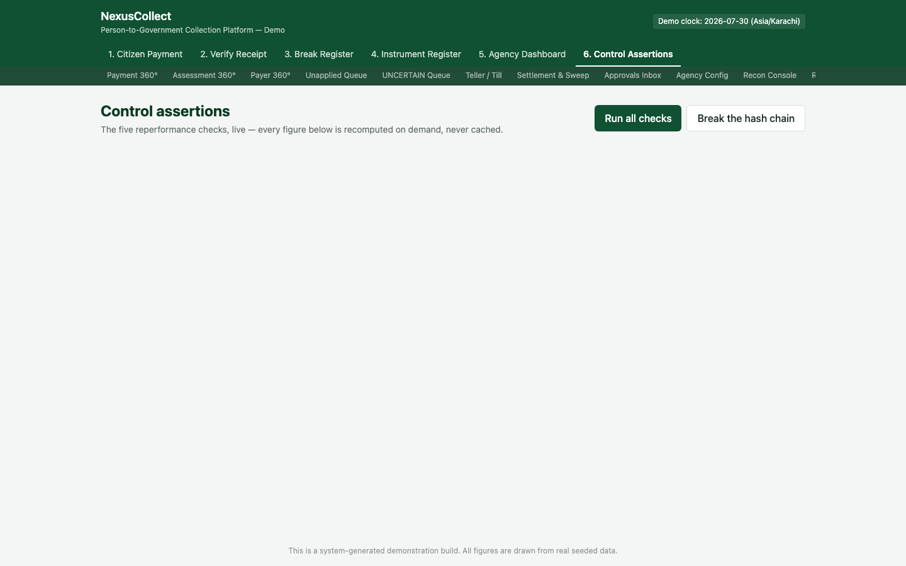
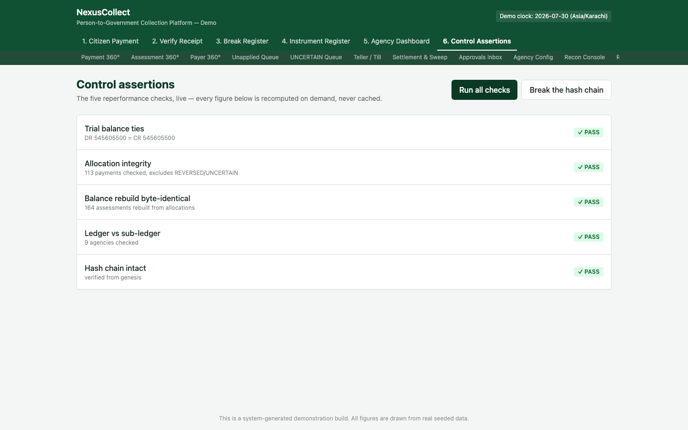
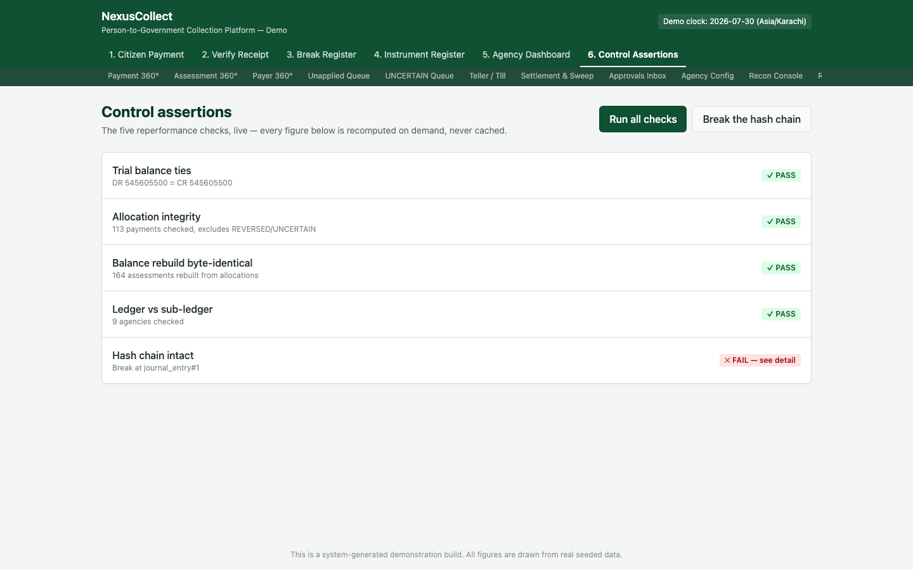

# 6. Screen 6 — Control Assertions

**Who this is for:** auditors, government reviewers, engineering/operations staff, and anyone who needs proof — not just a claim — that the platform's books are correct.

**What it does:** runs five independent, live re-performance checks against the platform's real data, and demonstrates that any tampering with the underlying records is immediately and specifically detectable.

## Why this screen exists

Anyone can claim their books are correct. This screen exists to let you **check the claim yourself**, on demand, against live data — and then, for the ultimate proof, to deliberately corrupt a record and watch the system catch it and name exactly what was tampered with. This is the platform's other "signature" demonstration (alongside the [cheque dishonour cascade](04-instrument-register.md)), and it is specifically designed to be the moment that builds trust with a sceptical audience.

## Where to find it

Tab **"6. Control Assertions"** in the top navigation.

## Step 1 — Run all checks

Click **"Run all checks."** Every figure that follows is **recomputed live, from scratch, at the moment you click** — nothing here is a cached or pre-stored result.

## Step 2 — Review the five checks

| # | Check | What it proves | Result shown |
|---|---|---|---|
| 1 | **Trial balance ties** | Every debit in the entire ledger is matched by an equal credit — the most fundamental accounting invariant there is | `DR 545,605,500 = CR 545,605,500` — **PASS** |
| 2 | **Allocation integrity** | For every live payment, the amount applied to bills plus the amount left unapplied always equals exactly what was paid — no money is ever lost or invented in the allocation process | 113 payments checked (excluding reversed/uncertain ones, which are checked differently) — **PASS** |
| 3 | **Balance rebuild byte-identical** | Every bill's cached "amount owed" figure can be **recomputed from scratch**, purely from its underlying payment allocations, and matches the stored figure exactly, down to the last paisa | 164 assessments rebuilt — **PASS** |
| 4 | **Ledger vs. sub-ledger** | Each agency's own payable balance, as tracked in its dedicated ledger account, matches the sum of that agency's actual unswept allocations | 9 agencies checked — **PASS** |
| 5 | **Hash chain intact** | Every entry ever posted to the ledger is cryptographically linked to the one before it, all the way back to the very first entry — if a single historical entry were ever altered, this chain would break at exactly that point | Verified from genesis — **PASS** |

> **Why "byte-identical" for check 3?** Balances shown anywhere in the platform (an agency dashboard total, a bill's outstanding amount) are **cached** for speed — but a cache is only trustworthy if it can always be proven to match a from-scratch recalculation. This check is that proof, run across every single bill in the system, every time you click the button.

## Step 3 — Prove tampering is caught, not just claimed

Click **"Break the hash chain."** This deliberately, artificially corrupts one historical ledger entry — simulating what would happen if someone tried to alter a past financial record after the fact.

Notice what happens:

- **Checks 1 through 4 still pass.** Tampering with one entry's chain link doesn't (by itself) unbalance the books or break allocation math — which is exactly why a hash chain is needed as a *separate* check in the first place. A clever alteration could, in principle, keep the debits and credits balanced while still rewriting history.
- **Check 5 fails, and names the exact entry**: `Break at journal_entry#1`. This is the critical detail. A weaker system might just say "hash chain check: FAILED" — leaving an auditor to search through potentially millions of entries to find the problem. This one points directly at the specific broken link.

This is the entire point of the mechanism: financial history in this platform cannot be quietly rewritten. Any attempt leaves a specific, locatable fingerprint.

> After a demonstration, the platform's data can be reset to its clean seeded state (see [the demo clock note](00-introduction-and-concepts.md#a-note-on-the-demonstration-environment) in the introduction) — this tamper is not a permanent state of the demo environment.

## How to read this screen for different audiences

- **If you're a government reviewer deciding whether to trust this platform**, this is the screen to focus on. Ask to see the hash chain deliberately broken and watch it get caught — that single demonstration answers "how do we know the books can't be quietly altered?" more convincingly than any written assurance could.
- **If you're an auditor doing a periodic review**, running all five checks (without breaking anything) at the start of a review session gives you a clean, provable starting point before you begin sampling individual transactions.
- **If you're operations/engineering staff**, these same five checks are what stand between an accounting period being closeable and blocked — see [Settlement & Sweep](07-back-office-screens.md#settlement--sweep).

## Frequently asked questions

**Q: Do these checks run automatically, or only when someone clicks the button?**
A: In this demonstration build, they're triggered on demand so you can see the result immediately. The same underlying checks are also run automatically at key moments in normal operation — for example, before an accounting period is allowed to close.

**Q: What happens to the tampered data after I click "Break the hash chain"?**
A: It's a genuine change to the demo database's data, but the demo environment includes a reset function specifically so this kind of exploration never needs to be "undone" manually.

**Q: If check 5 fails, does that mean the money itself is gone or wrong?**
A: Not necessarily — a hash chain break specifically means the *historical record* has been altered in a way that doesn't match its original chain of custody. Checks 1-4 tell you separately whether the money itself still balances. Both kinds of integrity matter, which is why there are five checks and not just one.

**Q: Why does the "allocation integrity" check exclude reversed and uncertain payments?**
A: A reversed payment (see the [cheque dishonour cascade](04-instrument-register.md)) and an uncertain payment (see the [UNCERTAIN Queue](07-back-office-screens.md#uncertain-payments-queue)) are, by definition, not in a settled, final state — checking them against the same "applied + unapplied = paid" formula used for confirmed payments wouldn't be a meaningful test. They have their own separate handling.
