# 7. Back-Office Screens

**Who this is for:** internal operations staff, tellers, approvers, agency configuration owners, and reporting/audit users.

**What this section covers:** the 12 operational screens that sit below the main navigation bar, in their own row. These are the day-to-day working tools staff use once bills exist and money is moving — they're deliberately kept less prominent than the six citizen/trust screens (see [the UI priority order](00-introduction-and-concepts.md) — citizen journey clarity and head-wise reporting correctness always come first), but they are where most internal staff spend most of their time.

Each screen below is documented as its own section, in the order it appears in the navigation bar.

---

## Payment 360°

**Purpose:** find any payment and see its complete history in one place.

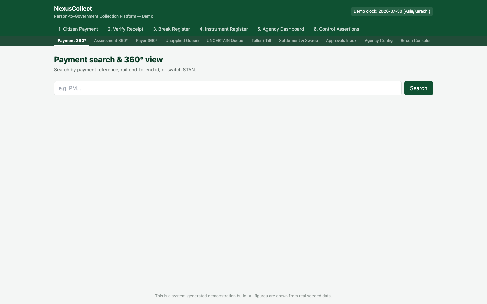

Search by payment reference, the payment rail's own end-to-end transaction ID, or a switch STAN (system trace audit number) — whatever identifier you have. The result shows the payment's amount, channel and rail, business date, and current status.

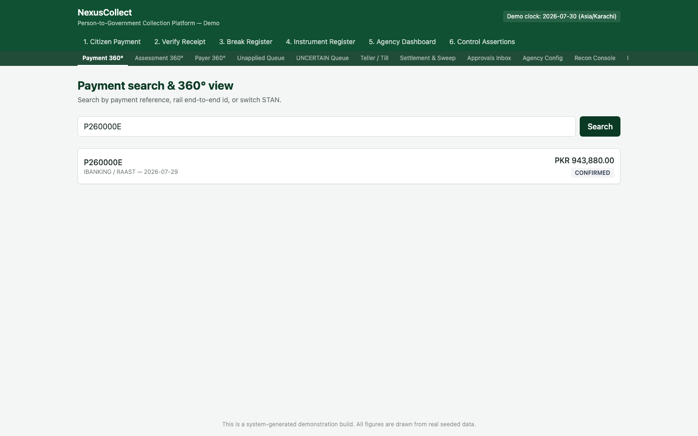

In the example above, payment `P260000E` (PKR 943,880.00, received via internet banking over the RAAST rail) is shown as `CONFIRMED`. This is the same payment referenced in the [Agency Dashboard](05-agency-dashboard.md) walkthrough of multi-head splitting — a single internet banking transaction that was automatically divided across three different revenue heads for one agency.

> **When to use this over the citizen-facing screens:** Payment 360° is for *investigating* a payment — tracing exactly what happened, which bills it touched, and its full status history — rather than simply confirming a receipt is genuine (that's [Screen 2](02-receipt-and-verification.md)) or looking up what's currently owed (that's [Screen 1](01-citizen-payment.md)).

---

## Assessment 360°

**Purpose:** look up a specific bill (assessment) and see its complete detail — line items, amendments, payment history, and current balance.

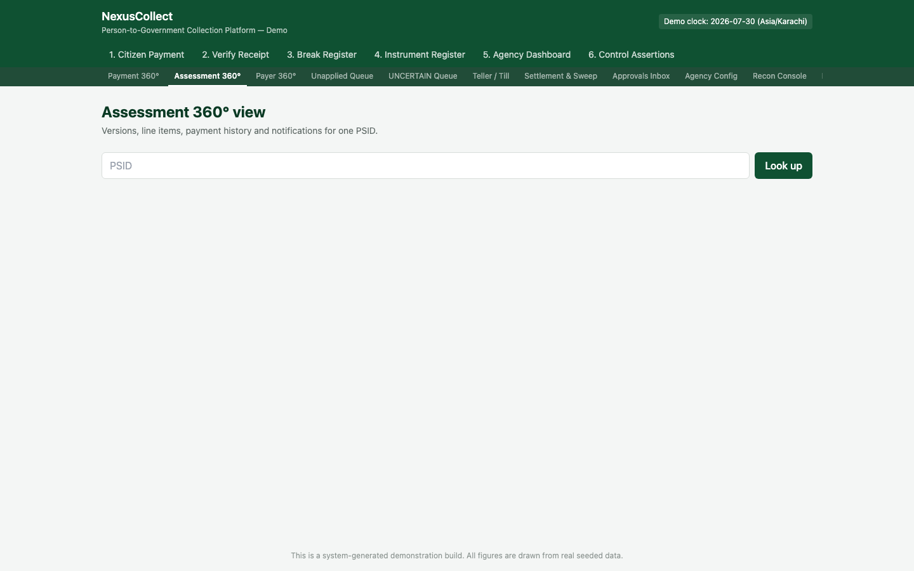

Search by PSID to pull up a bill's full record: its original assessed amount, any amendments made to it over time (see [the glossary](09-glossary.md) for how amendments work), every line item it's broken into, and every allocation that's been applied against it.

> **When to use this:** if a citizen disputes an amount, or an analyst needs to understand exactly why a bill shows a particular balance, this is the authoritative place to look — it shows the bill's complete history, not just its current snapshot.

---

## Payer 360°

**Purpose:** look up a specific payer (person or entity) and see every bill and payment associated with them, across every agency.

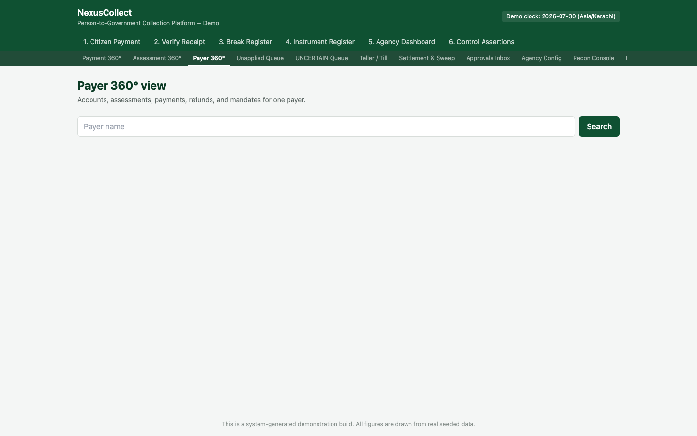

Where Assessment 360° is organized around one bill, Payer 360° is organized around one *person* — useful when someone calls in asking "what do I owe, across everything, everywhere" from an internal support context (as opposed to the anonymous, reference-based lookup on [Screen 1](01-citizen-payment.md)).

---

## Unapplied Receipts Queue

**Purpose:** track money the platform has definitely received, but which hasn't yet been linked to a specific bill.

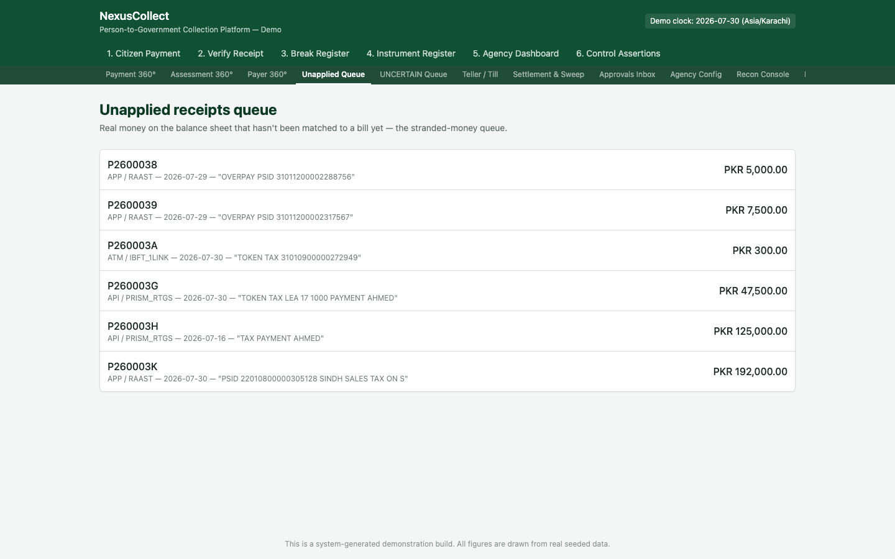

Recall from [the introduction](00-introduction-and-concepts.md#5-money-that-has-left-a-payers-account-is-always-accepted--never-rejected) that the platform never rejects money that has genuinely left a payer's account, even if it arrives with an unclear or missing reference. When that happens, the money is held here — safely recorded, fully accounted for in the ledger, but not yet linked to any specific bill — until an analyst can work out where it belongs.

> **This is not the same as a reconciliation break** ([Screen 3](03-break-register.md)). A break is a *disagreement* between two systems' records. An unapplied receipt is money everyone agrees was received — it just hasn't been matched to a bill yet. (Notice that reconciliation break **B06** specifically flags unapplied receipts that have been sitting unresolved *for too long* — the two concepts are related but distinct.)

---

## UNCERTAIN Payments Queue

**Purpose:** resolve payments whose success or failure genuinely couldn't be determined at the time they arrived.

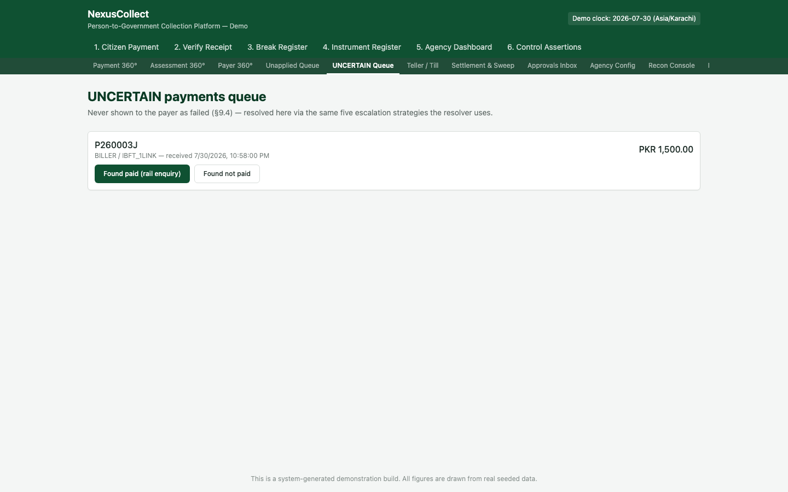

As explained in [the introduction](00-introduction-and-concepts.md#4-uncertain-is-a-real-first-class-state--not-a-failure), a payment lands here — never shown to the payer as a failure — whenever the platform cannot yet confirm what actually happened. Each entry shows the payment reference, channel/rail, when it was received, and the amount, with two resolution actions:

- **"Found paid (rail enquiry)"** — evidence (typically a direct enquiry to the payment rail) confirms the money genuinely arrived; the payment is processed through the normal allocation logic exactly as if it had confirmed instantly.
- **"Found not paid"** — evidence confirms it did not go through; the payment is marked failed.

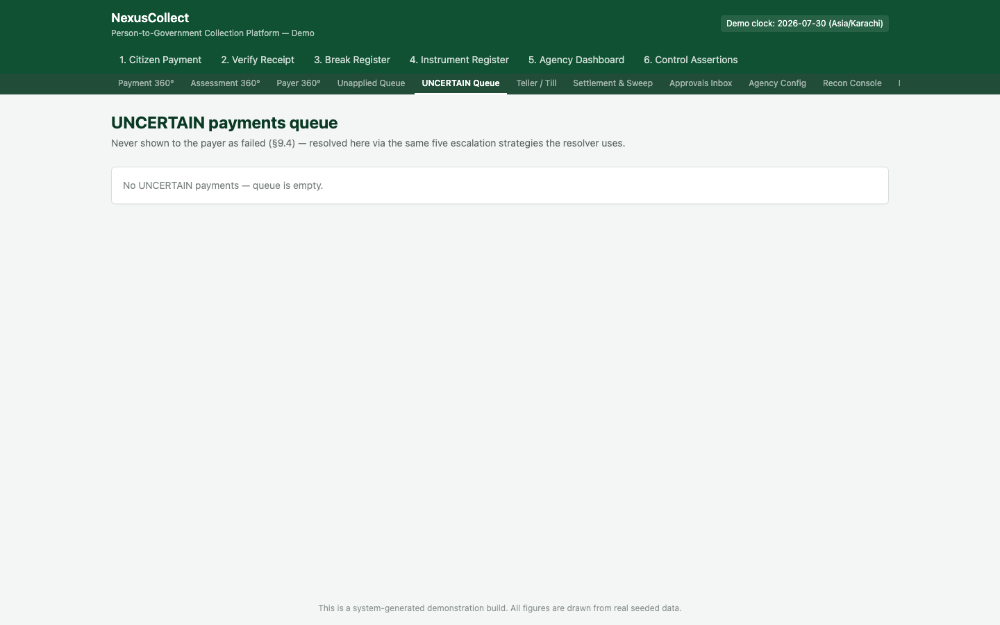

After resolving `P260003J` as found-paid, the queue is empty, and — as shown in the [Payment 360°](#payment-360) section above — that same payment reference now shows as `CONFIRMED`, fully allocated, exactly as though it had never been uncertain.

> **Why does this matter so much?** This queue is where the platform's most important design promise is kept: a citizen is never told their payment failed just because *confirmation* was delayed. The money sits here, safely tracked, until real evidence settles the question one way or the other.

---

## Teller / Till

**Purpose:** the workstation tool for staff accepting payments in person — cash, cheques, and other over-the-counter instruments.

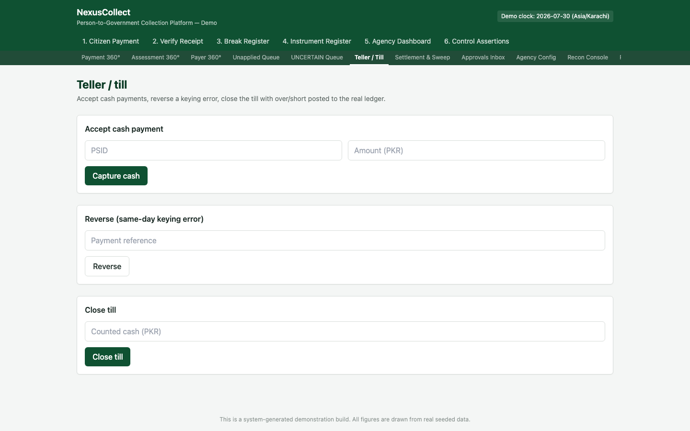

This is where a physical, in-person payment (cash handed across a counter, a cheque physically lodged) is captured on the citizen's behalf, and where a till is reconciled and closed out at the end of a shift.

---

## Settlement & Sweep

**Purpose:** manage the movement of confirmed, settled money from the platform's own collection account into government treasury.

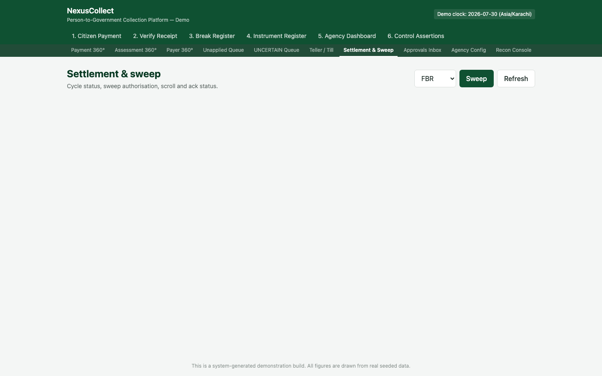

This screen is the operational home of the "swept" figure you saw on the [Agency Dashboard](05-agency-dashboard.md). Running a sweep here moves eligible funds to treasury and generates the **scroll** — a formal, itemised hand-off document (one line per allocation) that treasury uses to acknowledge receipt.

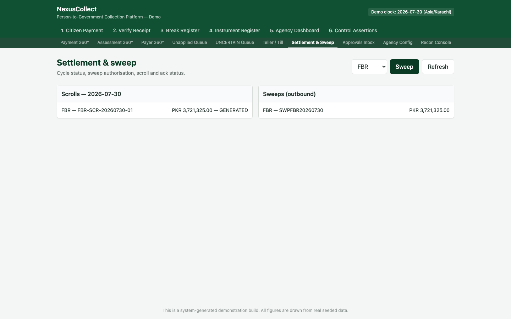

A few rules are enforced here, strictly:

- **Provisional (uncleared) funds can never be swept.** If a cheque hasn't cleared yet, the money behind it is excluded from every sweep, no matter how long it's been sitting as "confirmed" — this is a hard rule, not a matter of scheduling convenience.
- **A scroll is never emitted if its control total doesn't tie exactly to the ledger.** If the numbers don't match to the paisa, the platform refuses to generate the document rather than send treasury a hand-off that might be wrong.
- **An accounting period cannot be closed while any CRITICAL or HIGH severity reconciliation break remains open** (see [Screen 3](03-break-register.md)) — and once a period is closed, it cannot be reopened. This is a deliberate, irreversible control: it prevents a closed financial period from being quietly revised after the fact.

> **For finance officers:** this is where you'd come to understand exactly *when* a given day's collections will actually reach the treasury account, and to review the scroll that documents that hand-off.

---

## Approvals Inbox

**Purpose:** the single place where anything requiring maker-checker sign-off (see [the introduction](00-introduction-and-concepts.md#6-maker-checker-separation-of-duties)) shows up for the approving user.

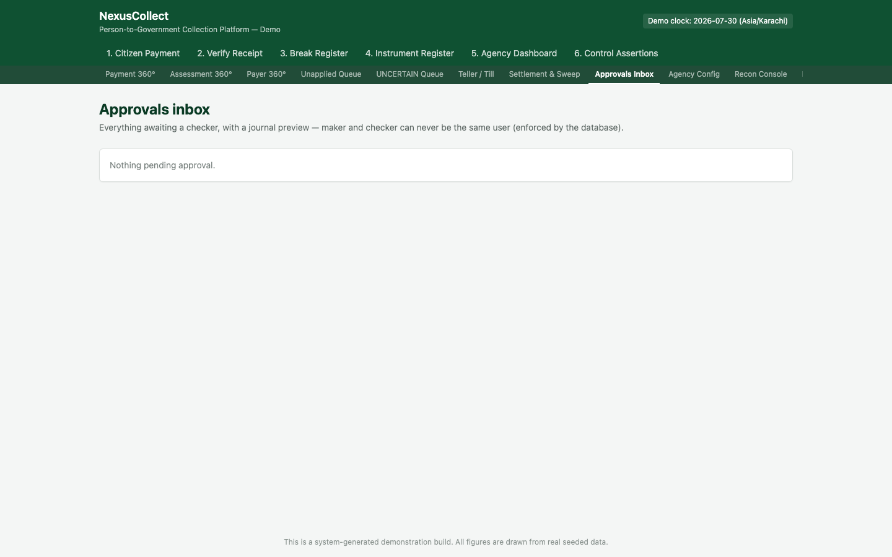

Proposed break resolutions, refund approvals, and other dual-control actions land here for the designated approver — always a different person from whoever proposed the action.

---

## Agency Config

**Purpose:** manage the agencies and products (bill types) the platform collects on behalf of.

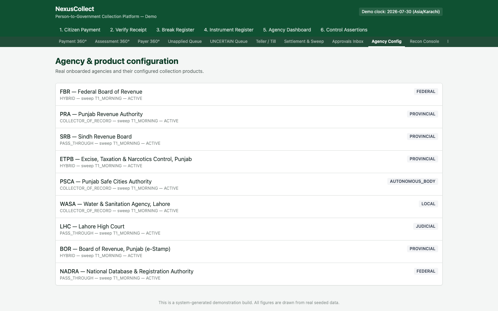

This is where an agency's own identity (name, code), its products (specific categories of bill it issues, such as "Motor Vehicle Token Tax"), and their associated rules (surcharge rates, early-payment discount windows, waterfall/allocation order) are configured. Changing a rule here never retroactively changes a bill that's already been assessed under the old rule — every rule change is versioned, so historical bills remain calculated exactly as they always were.

---

## Recon Console

**Purpose:** the detailed operational view for reconciliation staff working through the day-to-day matching process behind [the Break Register](03-break-register.md).

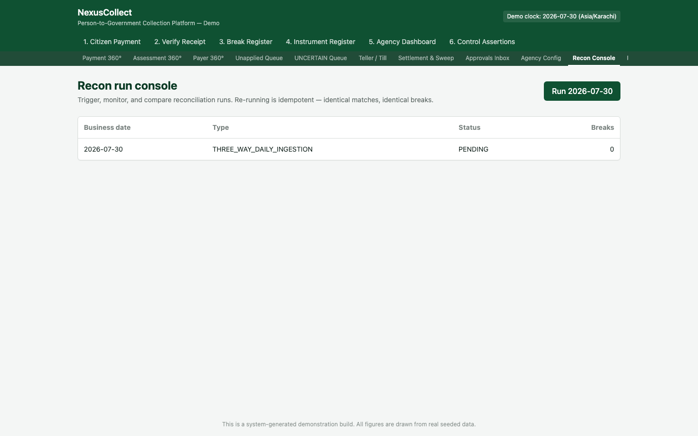

Where the Break Register (Screen 3) shows the *results* of a reconciliation run in a form built for reviewing outcomes, the Recon Console is the working tool for staff actively processing the underlying source files (bank statements, switch settlement files, rail settlement files) day to day.

---

## Report Centre

**Purpose:** run any of the platform's 18 standard reports against real, live data.

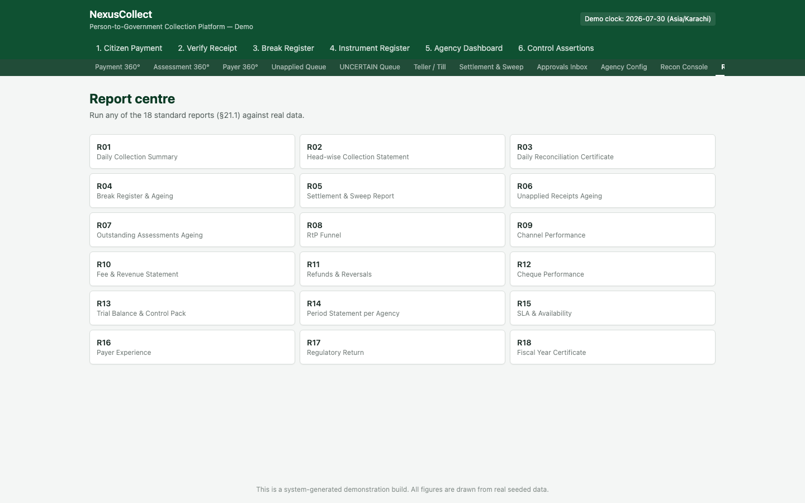

Every report is generated from a real query against the platform's actual data — never a static or sample export. Clicking a report runs it immediately and shows the result inline.

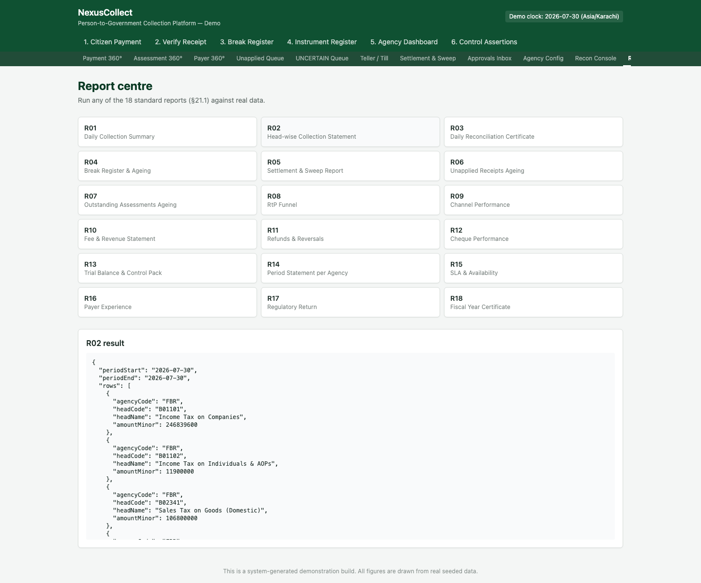

The 18 reports cover the full operational and financial reporting need of the platform, including:

| Report | What it covers |
|---|---|
| R01 — Daily Collection Summary | Total collections for a given business day |
| R02 — Head-wise Collection Statement | Collections broken down by revenue head (shown above) |
| R03 — Daily Reconciliation Certificate | A formal statement of the day's reconciliation outcome |
| R04 — Break Register & Ageing | How long open reconciliation breaks have been outstanding |
| R05 — Settlement & Sweep Report | Detail behind each sweep cycle |
| R06 — Unapplied Receipts Ageing | How long unapplied money has been sitting unmatched |
| R07 — Outstanding Assessments Ageing | How overdue unpaid bills are |
| R08 — RtP Funnel | Request-to-Pay conversion funnel (sent → seen → paid) |
| R09 — Channel Performance | Comparative performance across payment channels |
| R10 — Fee & Revenue Statement | Fee income and revenue breakdown |
| R11 — Refunds & Reversals | All refund and reversal activity |
| R12 — Cheque Performance | Clearance rates and dishonour rates for physical instruments |
| R13 — Trial Balance & Control Pack | The full set of control assertions (see [Screen 6](06-control-assertions.md)) as a formal report |
| R14 — Period Statement per Agency | A formal agency-level statement for a given accounting period |
| R15 — SLA & Availability | Service-level performance |
| R16 — Payer Experience | Aggregate metrics on the citizen payment journey |
| R17 — Regulatory Return | A formatted return suitable for regulatory submission |
| R18 — Fiscal Year Certificate | A formal, cryptographically signed certificate of a full fiscal year's collections (using the same signing mechanism as [receipt verification](02-receipt-and-verification.md)) |

> **A note of honesty, in keeping with this platform's standards:** a small number of these reports (channel performance, SLA/availability, payer experience) depend on operational telemetry — such as per-transaction latency or support-ticket themes — that this demonstration build does not yet independently track. Where that's the case, the report says so explicitly rather than fabricating a plausible-looking number. Every figure you *do* see in any report is real and drawn from actual data.

---

## Audit Explorer

**Purpose:** search the complete audit trail of every significant action taken in the platform, and independently verify that trail hasn't been tampered with.

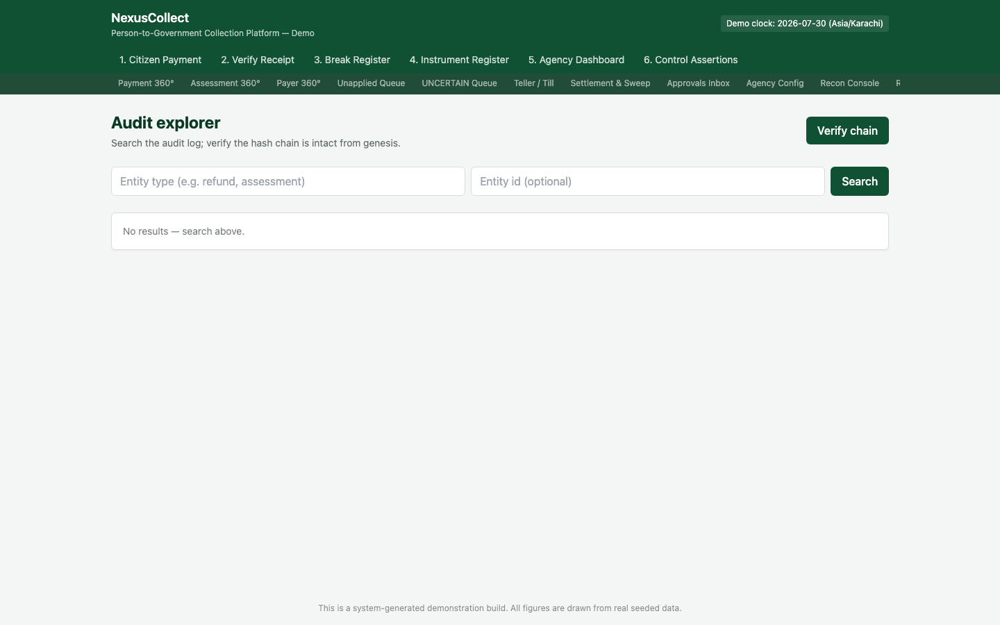

This is a **separate** hash chain from the ledger's own chain (see [Screen 6](06-control-assertions.md)) — this one covers *who did what, and when*, across the whole platform (every approval, every break resolution, every configuration change), rather than the financial entries themselves. Clicking **"Verify chain"** re-checks this entire audit trail's integrity from its very first entry, exactly the same way the ledger's own chain is checked.

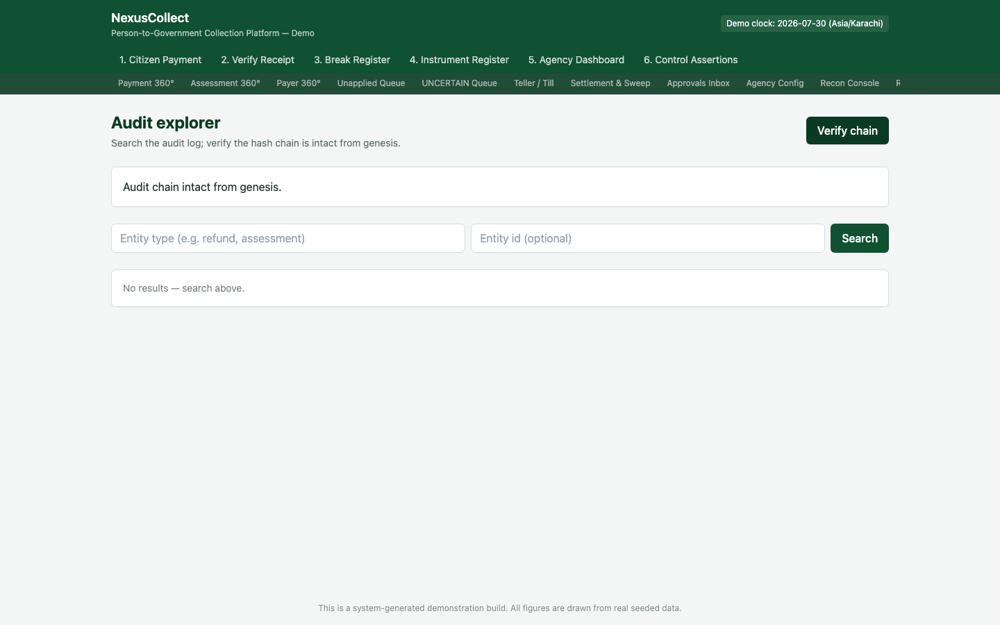

You can also search by entity type (e.g. "refund", "assessment") and an optional specific entity ID, to see the complete history of actions taken against a particular record.

> **Why two separate chains?** The ledger's hash chain proves the *money* hasn't been quietly rewritten. The audit chain proves the *record of human and system actions* hasn't been quietly rewritten either — who approved what, and when. Together, they cover both halves of "can we trust this system's history."

---

## What to do next

If you've now read through every screen in this manual, continue to [Flows & Diagrams](08-flows-and-diagrams.md) for an end-to-end visual summary of how these screens connect during real processes, or the [Glossary](09-glossary.md) for quick term lookups.
