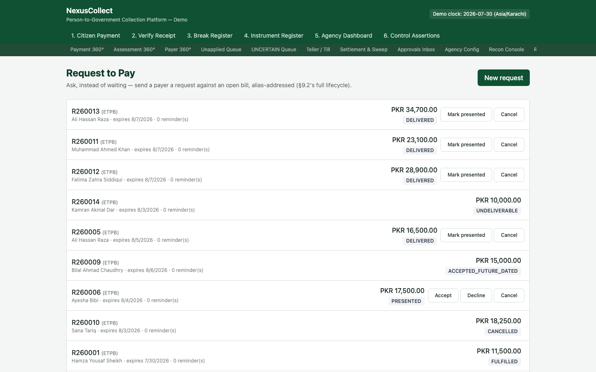
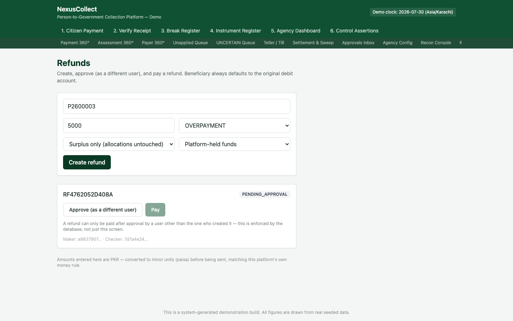
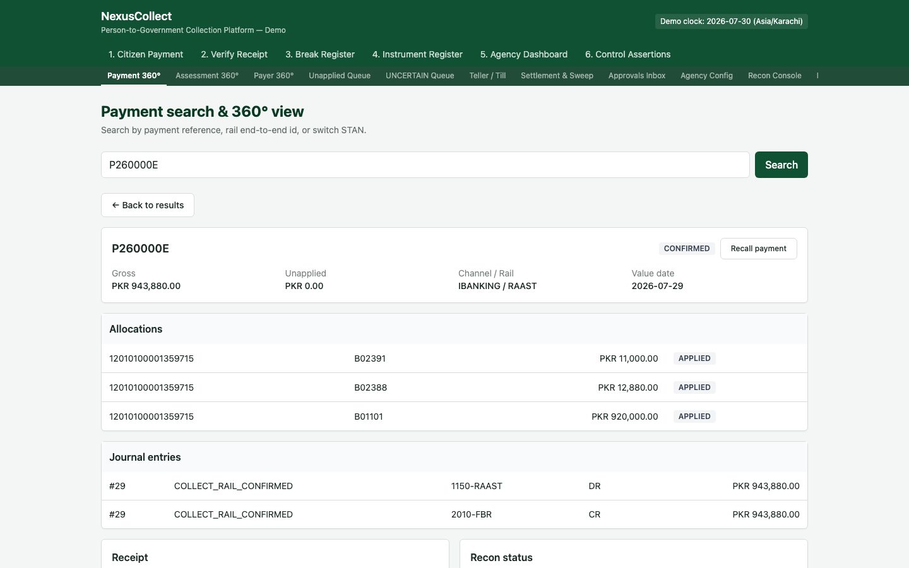
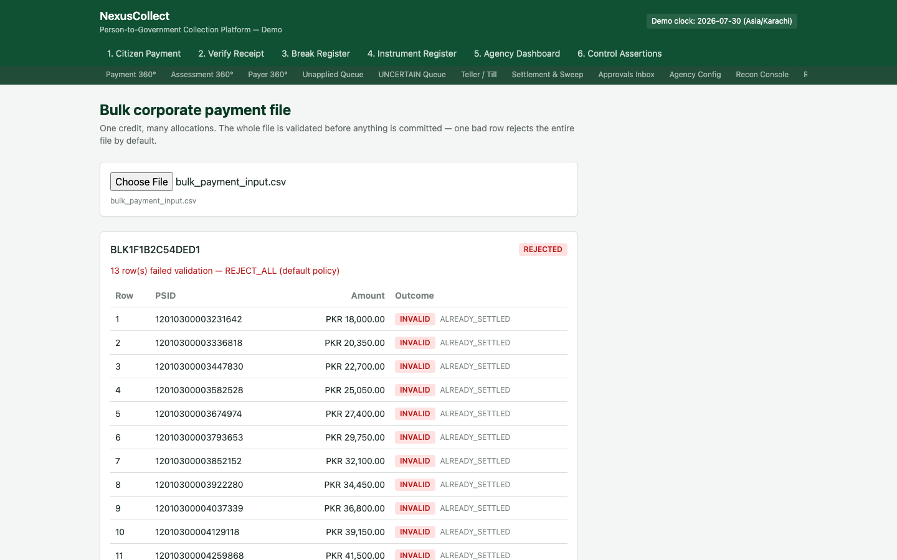
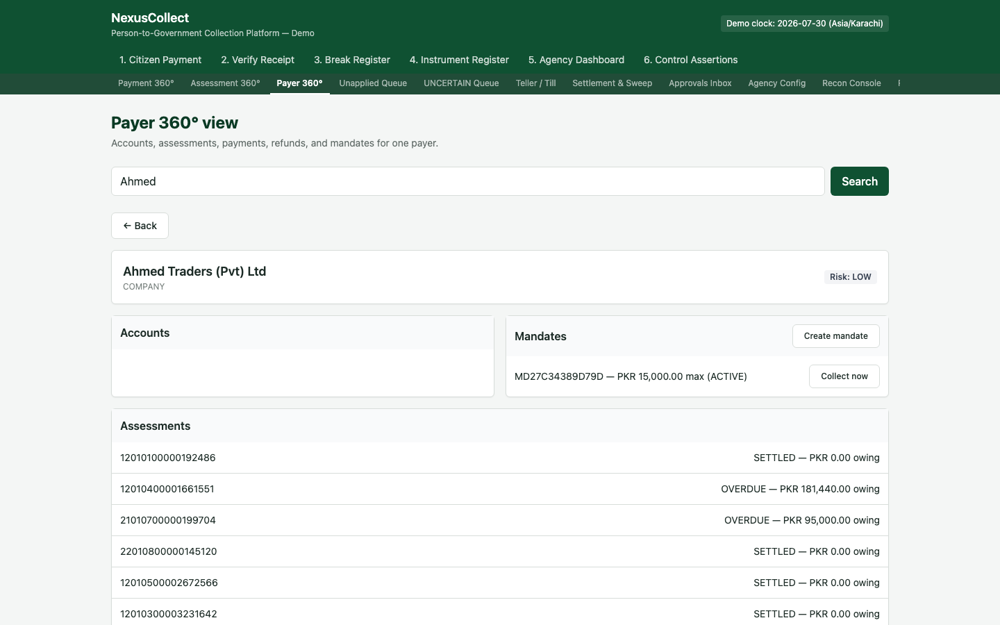
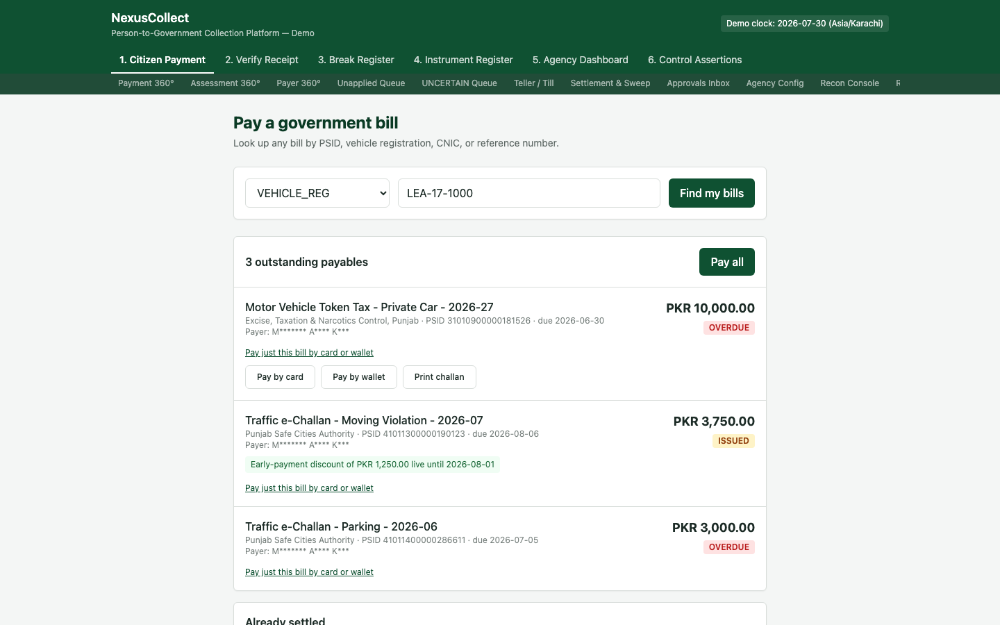
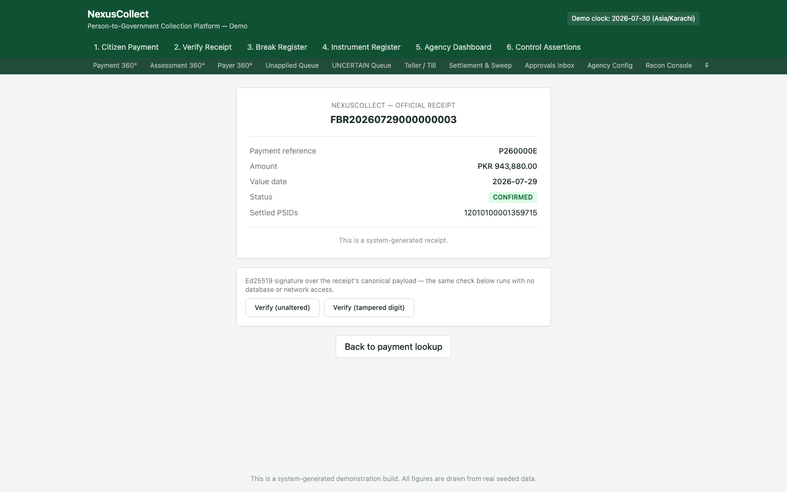
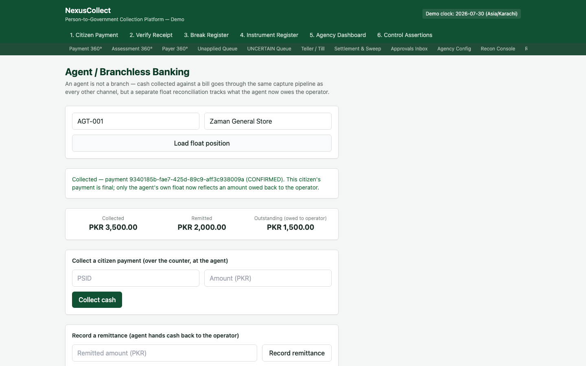

# 10. Payment Channels & Money-Movement Flows

**Who this is for:** internal operations staff, tellers, and agency finance officers working with the payment channels and money-movement tools added after the original six screens — asking to be paid instead of waiting, refunding money, moving a bulk corporate file, collecting under a standing mandate, taking a card or wallet payment, viewing a cryptographically signed receipt, and running the agent/branchless-banking channel.

**What this section covers:** eight related but distinct capabilities, each documented as its own section below, in the order they appear in the navigation bar.

---

## Request to Pay

**Purpose:** ask a payer for money, instead of only waiting for them to look up and pay a bill on their own.

A Request to Pay ("RtP") is a message sent to a specific payer, addressed by alias (name, phone number, or similar), asking them to settle a specific bill by a given expiry date. It moves through its own lifecycle, visible in the status badge on each row:

| Status | Meaning |
|---|---|
| `CREATED` | Drafted, not yet sent |
| `DELIVERED` | Sent and confirmed received by the payer's channel |
| `UNDELIVERABLE` | Could not be delivered (bad alias, channel unreachable) |
| `PRESENTED` | The payer has actually seen it |
| `ACCEPTED` / `ACCEPTED_FUTURE_DATED` | The payer agreed to pay — either now, or on a future date they chose |
| `DECLINED` | The payer refused |
| `CANCELLED` | Withdrawn before a decision |
| `FULFILLED` | Payment has actually been made against it |

Click **"New request"** to create one against a specific assessment. For a request still awaiting the payer's response, **"Mark presented"** records that it's been seen, and **"Cancel"** withdraws it.

> **Why this matters:** for many government bills, the citizen never proactively checks whether something is owed. RtP flips the model — the agency (or the platform on its behalf) reaches out first. Acceptance and fulfilment still go through the exact same underlying payment pipeline as every other channel; RtP only changes *how the request to pay reaches the citizen*, never how the money itself is captured or allocated.

---

## Refunds

**Purpose:** return money to a payer, under full maker-checker control.

Fill in the payment reference, amount, and reason, then choose:

- **Mode** — **"Surplus only"** leaves the original bill's allocations completely untouched (used when the refund is of money that was never actually applied to a bill, e.g. a genuine overpayment); **"Full reversal"** actually unwinds the original allocation, putting the bill back into its pre-payment state.
- **Funding source** — **"Platform-held funds"** (money the platform can refund unilaterally) versus **"Agency-funded"** (money already swept to the agency — the agency itself must authorise the refund).

Once created, a refund sits at **`PENDING_APPROVAL`** until a **different** user approves it (**"Approve (as a different user)"**) — the database itself enforces that the maker and checker can never be the same account, exactly as with break resolution. Only after approval can the refund be paid (**"Pay"**).

> **Beneficiary defaults to the original debit account.** A refund never asks where to send money — it always goes back to the account the original payment came from, unless a maker explicitly overrides it, which itself requires approval. This closes the most common refund-fraud vector: nobody can quietly redirect a refund to an account of their own choosing without a second person signing off.

---

## Recall a Payment

**Purpose:** ask for a payment back, immediately after the fact — before it's necessarily gone anywhere.

A **"Recall payment"** button appears on every payment's detail view in [Payment 360°](07-back-office-screens.md#payment-360).

A recall is not a blind, automatic reversal — the outcome depends entirely on where the money currently stands:

- **Not yet allocated to any bill:** the platform can safely return it immediately.
- **Allocated to a bill, but not yet swept to the agency:** this is already government revenue, in every meaningful sense — the platform cannot unilaterally decide to give it back. The recall is recorded as pending the **agency's own decision**.
- **Already swept to the agency:** the money has genuinely left the platform's control. The recall is rejected outright, with a real ISO 20022 `camt.029` reason code (`AC04`, "funds transferred to beneficiary") pointing the requester toward the agency's own refund process instead.

> **Why a recall isn't always a refund:** a recall is a request made very soon after a payment, often because of a mistake — a citizen recall is meaningfully different from a refund raised weeks later against settled money. This platform models both honestly rather than collapsing them into one mechanism.

---

## Bulk Payments

**Purpose:** apply one corporate credit against many bills at once, from a single uploaded file.

Choose a file (one row per PSID + amount) and it is validated **before anything is committed** — every row is checked, and by default a single bad row (an unknown PSID, an already-settled bill, a mismatched amount) causes the **entire file** to be rejected, not just that row. The screenshot above shows exactly this: 13 of the file's rows reference PSIDs that are already settled, so the whole batch (`BLK1F1B2C54DED1`) comes back `REJECTED`, with every failing row named individually.

> **Why reject the whole file by default, rather than apply the good rows?** A corporate payer submitting a bulk file is making one statement about their total intended payment. Silently applying only the valid rows would leave the payer's own reconciliation of "did my whole file go through" wrong, without them necessarily noticing. Rejecting the whole file surfaces the discrepancy immediately, where it can be corrected and resubmitted.

Once a file validates cleanly, **"Confirm"** applies it as one real payment, settling every referenced bill in a single transaction.

---

## Mandates (Standing Authorisation)

**Purpose:** let a payer pre-authorise recurring collections against a bill type, so future bills are collected automatically without asking each time.

From [Payer 360°](07-back-office-screens.md#payer-360), **"Create mandate"** sets up a standing authorisation: a maximum amount per collection, a frequency (monthly/quarterly/annual), and a first collection date, against a specific product. A mandate is, under the hood, the exact same Request-to-Pay machinery described above — with the crucial difference that consent was already granted when the mandate was created, so a collection under it never has to wait for a fresh acceptance.

**"Collect now"** performs one real collection under the mandate: a PSID and amount, capped at the mandate's own maximum. If a collection attempt fails, it is retried a limited number of times before the mandate is automatically suspended, rather than retried forever.

---

## Card & Wallet Payments

**Purpose:** accept a card or mobile wallet payment, with a hard architectural guarantee that the platform never touches the actual card number.

On [Citizen Payment](01-citizen-payment.md), the link **"Pay just this bill by card or wallet"** reveals **"Pay by card"** and **"Pay by wallet"** for that specific payable. What the platform stores afterward is deliberately minimal:

- **Card:** a gateway token, the card's first six digits (BIN), and its last four digits — never the full card number (PAN). The actual card number is handled entirely by the hosted payment gateway, which the platform never sees.
- **Wallet:** the wallet provider's name and a masked phone number.

Both payment types flow through the **exact same capture and allocation pipeline** as every other channel — cash, cheque, internet banking, or anything else. There is no special-cased "card path" through the core ledger logic; card and wallet are simply two more channels, each with their own thin adapter that knows how to talk to their respective gateway/provider and nothing more.

> **Why this matters:** never storing a PAN is what keeps this platform out of the heaviest tier of card-industry compliance scope (PCI DSS). It's a real architectural property, not a policy promise — the database schema itself has no column capable of holding a full card number.

---

## Signed Receipts (Offline Verification)

**Purpose:** prove a receipt is genuine without any network connection at all, using a cryptographic signature rather than a lookup.

From any [Receipt](02-receipt-and-verification.md), **"View signed receipt (offline-verifiable)"** shows the receipt's canonical detail alongside an Ed25519 digital signature computed over that exact content. **"Verify (unaltered)"** re-checks the signature against the payload as shown — the same check works with **zero database access and zero network connection**, which is exactly the point: a field inspector or an offline kiosk can confirm a receipt is real using only the receipt itself and the platform's known public key.

**"Verify (tampered digit)"** demonstrates the failure case deliberately: it alters one digit of the payload and reruns the exact same check, which now fails — proving the signature genuinely covers the content, rather than being a decorative badge.

> **How this differs from the online verification on [Screen 2](02-receipt-and-verification.md):** that screen looks a receipt up by its reference and asks the platform's own database "is this still valid, or has it since been voided/refunded?" — a question only the live system can answer. This screen answers a narrower but network-independent question: "does this exact piece of paper/PDF match what was genuinely signed, unaltered?" Both matter; they answer different questions.

---

## Agent / Branchless Banking

**Purpose:** let a citizen pay a bill in cash at a neighbourhood shop or kiosk acting as a collection agent, without that agent being treated as a bank branch.

**"Collect cash"** captures a citizen's payment at the agent, against a specific PSID — and that payment goes through the **exact same capture pipeline** as every other channel; from the citizen's point of view, and the ledger's, it is final and correctly allocated the moment it's collected. What's genuinely different is tracked **separately**, in the agent's own **float**:

- **Collected** — the running total of cash the agent has taken in on the platform's behalf.
- **Remitted** — how much of that cash the agent has physically handed back to the operator.
- **Outstanding (owed to operator)** — always calculated as collected minus remitted, never a separately-cached number, matching the platform's own rule that every derived balance must be reconstructable from its underlying movements rather than trusted as a running total.

**"Record a remittance"** logs the agent physically handing cash back, reducing the outstanding balance.

> **"An agent is not a branch."** The citizen's obligation is discharged the instant the agent accepts the cash — surcharge stops accruing, the bill shows paid, a receipt is issued. What the agent now *owes the operator* is a completely separate, parallel bookkeeping question, reconciled daily against the float, never conflated with whether the citizen's own bill is settled.

---

## What to do next

For the exception-handling, configuration, and governance capabilities that sit alongside these payment flows — disputes and chargebacks, refundable deposits, agency/product configuration, roles and permissions, and the Ops/Executive dashboards — continue to [Exceptions, Configuration & Governance](11-exceptions-configuration-and-governance.md).
