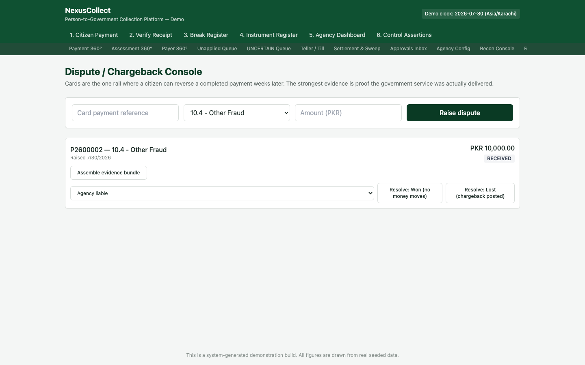
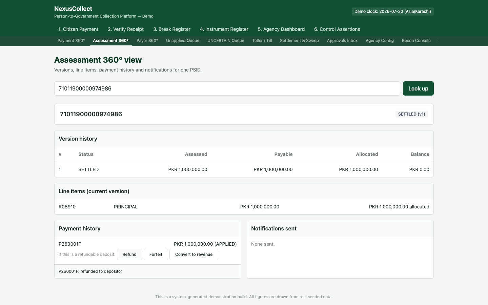
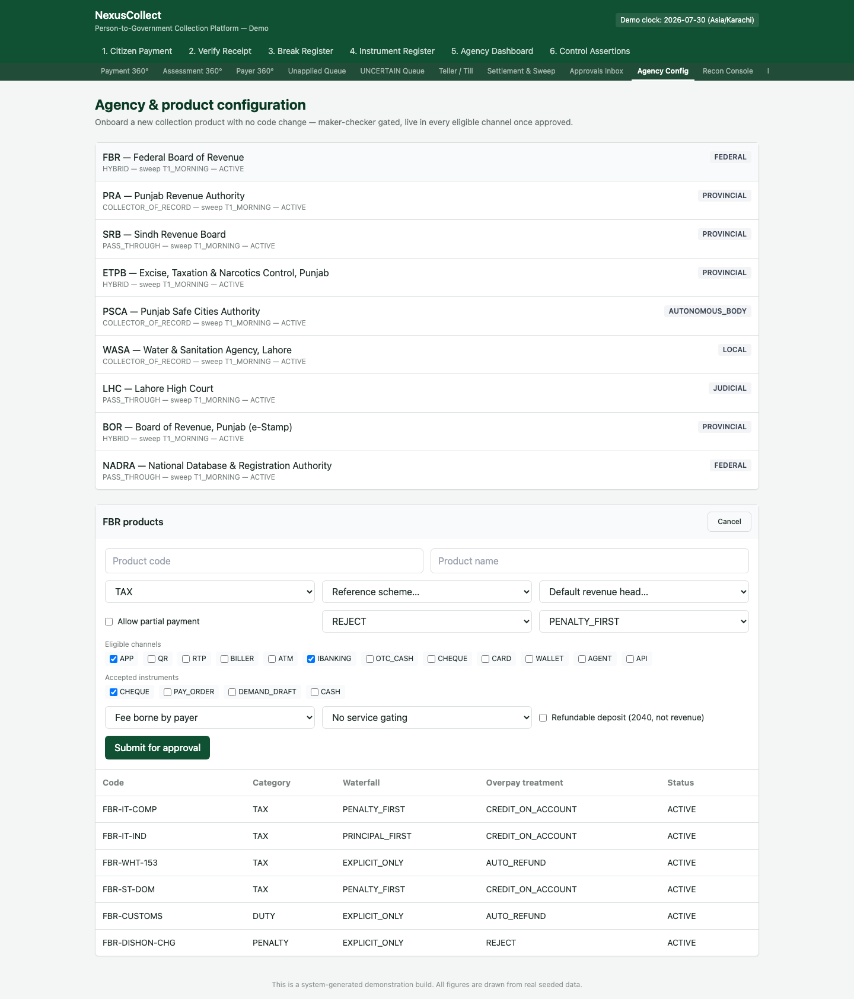
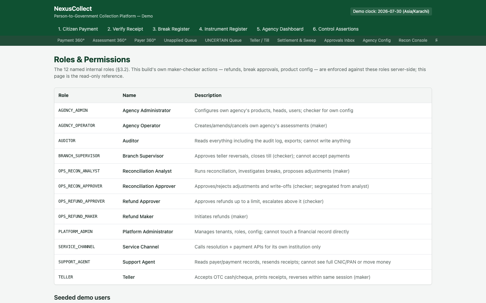
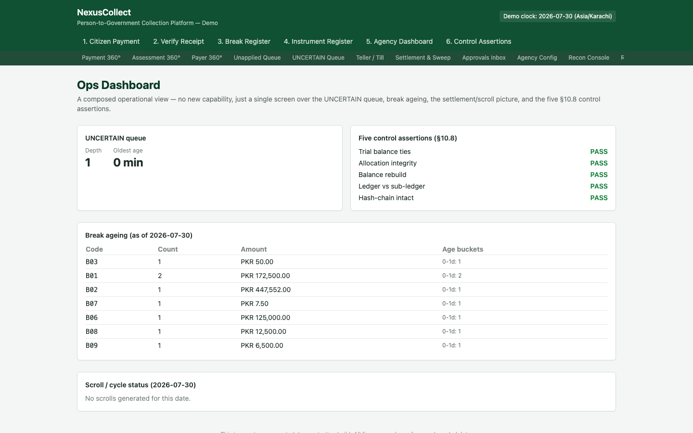
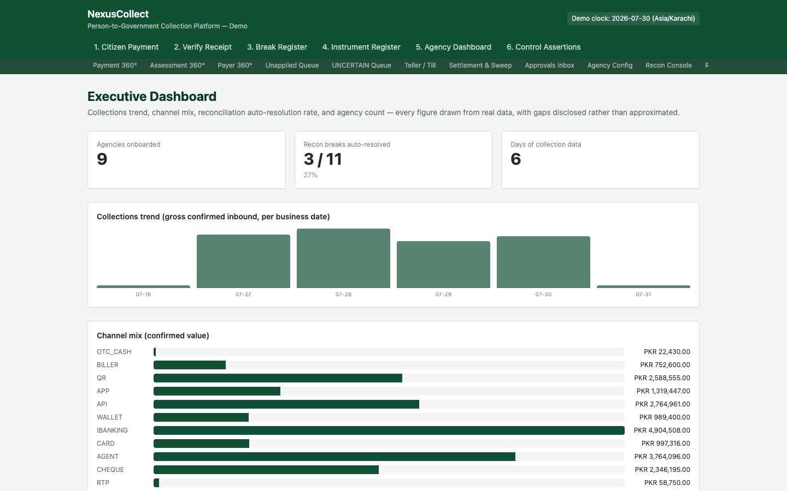

# 11. Exceptions, Configuration & Governance

**Who this is for:** operations staff handling card chargebacks and refundable deposits, agency administrators configuring products, anyone needing to understand who is allowed to do what, and management wanting a single-screen operational or executive view.

**What this section covers:** disputes and chargebacks, the refundable-deposit lifecycle (and its close relative, third-party payer handling), agency/product configuration, roles and permissions, and the two composed dashboards — Ops and Executive.

---

## Disputes & Chargebacks

**Purpose:** handle the one payment rail where a citizen can reverse a *completed* payment weeks after the fact — a card chargeback.

**"Raise dispute"** records a chargeback claim against a card payment: a scheme reason code (e.g. "Other Fraud," "Merchandise/Service Not Received"), and the disputed amount. From there:

- **"Assemble evidence bundle"** pulls together everything the platform can offer in the platform's defence — the original receipt, the resolution trace showing the bill was genuinely identified and paid, the assessment detail, and the full `application_trace` of how the money was allocated. The strongest evidence available is proof the government service the citizen paid for was actually delivered.
- **"Resolve: Won (no money moves)"** — the platform successfully contested the chargeback; nothing changes financially.
- **"Resolve: Lost (chargeback posted)"** — the platform loses the dispute, and a real ledger entry (debiting the agency's payable, crediting the card acquirer receivable) is posted for the disputed amount, with liability assigned per the dropdown (operator, agency, or shared).

> **Why chargebacks are handled separately from ordinary refunds:** an ordinary refund is something the platform or agency *decides* to do. A chargeback is a card network *forcing* a reversal, weeks after the payment looked completely final, through a completely different mechanism (the card scheme's own dispute process) — with its own evidence requirements and its own liability question. Modelling it as its own narrow lifecycle keeps that distinction honest rather than papering over it as "just another refund."

---

## Refundable Deposits

**Purpose:** correctly account for money that isn't revenue at all — a security deposit, litigation security, or tender bond — which the citizen is generally entitled to get back.

Certain products (e.g. a tender security deposit, a litigation deposit) are flagged as **refundable deposits**. When a payment against one of these is captured, the money is credited to a dedicated **liability** account (`2040`, Refundable Deposits) — deliberately **never** the ordinary agency-payable revenue account (`2010`) that every other bill's payment uses. This is the single most important accounting distinction on this screen: a deposit is money the platform is *holding on behalf of* the depositor, not money the agency has earned.

From a `CONFIRMED` payment on [Assessment 360°](07-back-office-screens.md#assessment-360), three exits are available:

- **Refund** — the deposit is returned to the depositor. (The screenshot above shows exactly this: "P260001F: refunded to depositor.")
- **Forfeit** — the depositor doesn't get it back (e.g. a tender bond forfeited for a withdrawn bid).
- **Convert to revenue** — the deposit is reclassified into genuine agency revenue (e.g. a security deposit applied against actual damages).

> **Why three different exits, not just "refund"?** A deposit's ultimate disposition is a real business decision, not automatically a refund — and getting the ledger accounts right (2040 liability moving to either cash-out, forfeiture income, or agency revenue) depends on which one actually happened. Treating every deposit exit as a generic refund would misstate what the money actually became.

### Third-party payer

A related, smaller feature on the same theme of "money isn't always about who it's for": when someone pays a bill on another person's behalf (a lawyer paying a client's court fee, a relative paying someone else's tax bill), the platform records **both** identities — the person who actually paid, and the person whose bill it was — visible on [Payment 360°](07-back-office-screens.md#payment-360) and printed on the receipt. Critically, if that payment is later refunded, the refund defaults to the account of the person who **actually paid** (the remitter), never the original taxpayer — the same fraud-prevention logic as the refund beneficiary rule above, applied to a slightly different question.

---

## Agency & Product Configuration

**Purpose:** onboard a new government agency's bill type — a "product" — without any code change, gated by the same maker-checker control used everywhere else in the platform.

**"New product"** opens a guided form covering every configurable dimension of a bill type:

| Field | What it controls |
|---|---|
| Reference scheme | which numbering format (PSID, etc.) this product's bills use |
| Allow partial payment | whether a citizen can pay less than the full amount |
| Overpayment treatment | reject / credit-on-account / auto-refund / absorb, when a payment exceeds what's owed |
| Allocation waterfall | the order money is applied across a bill's line items (penalty-first, principal-first, oldest-first, pro-rata, or explicit-only) |
| Eligible channels | which of the twelve channels (app, QR, RTP, biller, ATM, internet banking, OTC cash, cheque, card, wallet, agent, API) may be used to pay this bill |
| Accepted instruments | which physical instruments (cheque, pay order, demand draft, cash) are accepted |
| Fee bearer | who pays any transaction fee — the payer, the agency, or split |
| Refundable deposit | whether this product's payments should post to the deposits liability account (`2040`) instead of ordinary revenue (`2010`) — see above |

A submitted product starts life `PENDING_APPROVAL` and only goes live once a **different** user approves it — the same maker-checker rule enforced everywhere a proposal needs a second set of eyes (compare [break resolution](03-break-register.md) and [refund approval](10-payment-channels-and-flows.md#refunds)).

> **Changing a rule never rewrites history.** Every configuration change is versioned — an existing bill, already assessed under the old rule, keeps calculating exactly as it always did. A new rule only ever applies going forward.

---

## Roles & Permissions

**Purpose:** the read-only reference for the platform's twelve named internal roles, and who's assigned which.

Every internal user holds exactly one of twelve roles — from `AGENCY_ADMIN` (configures an agency's own products, checker for its own config) through `OPS_RECON_ANALYST`/`OPS_RECON_APPROVER` and `OPS_REFUND_MAKER`/`OPS_REFUND_APPROVER` (each an explicitly *segregated* maker/checker pair — the same person is never both) to `AUDITOR` (reads everything, including the audit log, but can never write anything) and `SUPPORT_AGENT` (can read payer/payment records and resend receipts, but cannot see a full CNIC/PAN or move money).

This page is deliberately read-only: it's the reference, not a place to edit assignments. The enforcement itself happens server-side — for example, approving a newly-proposed product configuration requires the caller to actually hold the `AGENCY_ADMIN` role, checked against exactly this table, not merely assumed from the screen they happen to be on.

> **Why name real people in the demo roster?** Ten named demo users (Bilal Farooq as Agency Admin, Ayesha Riaz as Reconciliation Approver, and so on), each holding exactly one role, make the maker-checker separation concrete and walkable — you can see, by name, that the person who proposes a break resolution is never the same person who's allowed to approve it.

---

## Ops Dashboard

**Purpose:** a single composed operational view for day-to-day staff — no new capability, just the most operationally relevant figures already available elsewhere, brought onto one screen.

Four panels, each reused from data this platform already produces:

- **UNCERTAIN queue** — how many payments are currently in the [UNCERTAIN state](07-back-office-screens.md#uncertain-payments-queue), and how long the oldest one has been waiting.
- **Five control assertions** — the same [§10.8 checks](06-control-assertions.md) shown live, as five pass/fail ticks.
- **Break ageing** — open reconciliation breaks grouped by code, with their age buckets (the same data behind report R04).
- **Scroll/cycle status** — whether a settlement scroll has been generated for the day, and its acknowledgement status.

> **Why build a "new" screen that adds nothing new?** Because staff shouldn't have to visit four separate screens every morning to get a sense of the platform's operational health. This is a genuinely different kind of value — composition, not new logic — and it's built accordingly: one new backend endpoint that aggregates existing queries, no new business rules.

---

## Executive Dashboard

**Purpose:** the management-level view — collections trend, channel mix, reconciliation health, and platform scale — with an explicit list of what isn't tracked, rather than an invented number filling the gap.

- **Agencies onboarded** — a simple real count.
- **Recon breaks auto-resolved** — the share of reconciliation breaks the platform resolved automatically without human intervention (in the seeded dataset, 3 of 11 — the same three the [Break Register](03-break-register.md) shows as auto-resolved rather than sitting open).
- **Collections trend** — gross confirmed inbound money, charted per real business date across the full seeded dataset (not just the single demo-anchor day).
- **Channel mix** — confirmed value by channel, the same underlying data as report R09.

> **What's honestly disclosed as not tracked, rather than approximated:** per-agency "time to onboard" (the platform has no onboarding-timestamp column at all) and digital-vs-cash mix by payer cohort (no cohort/segment dimension exists on a payer record). Both would be genuinely useful executive metrics, and both are named explicitly as gaps on this screen rather than filled in with a plausible-looking but fabricated figure — the same discipline applied to the [Report Centre's](07-back-office-screens.md#report-centre) own honestly-incomplete reports.

---

## What to do next

This completes the manual's coverage of every screen in the platform. Return to the [README](README.md) for the full document index, or the [Glossary](09-glossary.md) for quick term lookups — several new terms introduced in this section (RtP, mandate, refundable deposit, chargeback, agent float, role) are defined there too.
